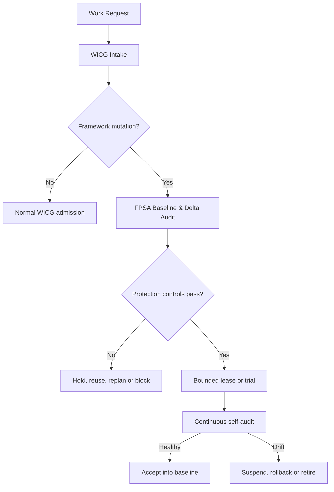

# WICG-FPSA v1.0 — Framework Protection, Self-Audit & Controlled Evolution

Status: **PROPOSED — NOT IN FORCE** until the operator's ratification merge of
the PR carrying `AGENTS.md` §33, and even then **binding only as §33 states**.
Provenance: supplied by the operator in session, 2026-08-11, as the follow-on
layer to WICG v1.0; transcribed by Claude (BST-SA Motor). Where this document
restates an in-force rule, the in-force `AGENTS.md` section governs.
Scope: portfolio/control-plane, extending
[`WICG-V1.0-WORK-INTAKE-GUARD.md`](WICG-V1.0-WORK-INTAKE-GUARD.md).
Identifier renamings applied per the `AGENTS.md` §33.2 rulings: the source's
protection layers `P1`–`P5` read **`FPL-1`–`FPL-5`** and its roadmap phases
`P0`–`P4` read **`FPSA-P0`–`FPSA-P4`** here (bare `P*` collides with bOPEN
phase numbering).

## Executive verdict

Extend WICG v1.0 with a protection layer: **FPSA — Framework Protection,
Self-Audit & Controlled Evolution**. FPSA does not forbid framework growth; it
requires that the framework expand only upon proof that:

1. a real gap exists;
2. existing capability cannot be reused;
3. the change is the smallest sufficient delta;
4. authority, scope, cost and impact are bounded;
5. it is auditable, reversible, expiring and removable;
6. the framework is not approving an expansion of its own authority.

The governing rule:

> **No proven gap, no minimal delta, no bounded authority, no rollback and
> retirement path — no framework expansion.**

## 1. The gaps FPSA closes

WICG governs duplicates, overlap, conflict and leases; it does not yet govern:
scope expansion (projects/tenants/environments without mandate) · capability
expansion (agents, modules, workflows, tools duplicating existing ones) ·
authority expansion (permissions, autonomy, protected-path access) · policy
expansion (rule sprawl into contradiction/unmaintainability) · integration
expansion (APIs, databases, external systems without lifecycle contracts) ·
evidence expansion (reports/KPIs with no consumer or decision linkage) ·
exception expansion (accumulating no-expiry exceptions becoming permanent
bypasses) · cost expansion (token/compute/CI/storage/observability without
ceilings) · self-approval (the framework editing its own classifier, quorum or
authority and approving it) · zombie components (retired pilots, plugins,
policies, workflows retaining live permissions). Aligned with NIST least
privilege / least functionality and OWASP Excessive Agency guidance:
downstream authorization is enforced by systems, never left to an LLM alone.

## 2. Placement in the WICG pipeline



Insertion point: `WICG.CONFLICT_CHECKED → FPSA.FRAMEWORK_CHANGE_CHECKED →
WICG.POLICY_CHECKED → WICG.ADMITTED`. Only work that mutates the framework,
policy, authority, shared components or control plane takes the full FPSA
path; ordinary product work keeps the plain WICG path so governance overhead
stays proportionate.

## 3. Five protection layers

| Layer | Duty |
| --- | --- |
| `FPL-1 Baseline Protection` | What the framework currently is, who owns each part, which version is in force |
| `FPL-2 Expansion Admission` | Necessity, reuse, minimal delta, authority, lifecycle |
| `FPL-3 Execution Envelope` | Confine files, resources, permissions, budget and time to what was approved |
| `FPL-4 Continuous Self-Audit` | Actual change vs approved, drift, cost, exceptions, control effectiveness |
| `FPL-5 Recertification & Retirement` | Accept into baseline, reduce scope, retire, or roll back |

(NIST SP 800-53: baseline configuration, change control, impact analysis,
continuous monitoring; NIST SP 800-137: continuous control monitoring.)

## 4. Framework Contract Registry

Every framework carries a canonical contract: `framework_id`, `version`,
`mandate` (e.g. prevent_duplicate_work, detect_cross_project_conflict,
enforce_work_lease), `non_mandate` (e.g. never change project business
strategy, never expand agent authority, never override constitutional
governance), `components` (each with id, owner, status, purpose),
`protected_resources` (authority policy, risk classifier, quorum policy,
bypass policy, self-audit policy), `approved_integrations`, `operating_caps`
(`max_active_exceptions: 0`, `max_unowned_components: 0`,
`max_expired_trials: 0`, `unauthorized_authority_expansion: 0`), and a
`baseline` (source SHA, policy bundle hash, schema version, effective date).

If the registry is incomplete, FPSA's verdict is `BASELINE_UNKNOWN →
FRAMEWORK_MUTATION_NOT_ADMISSIBLE`.

## 5. Expansion classification

Never average risk into one score — authority expansion must not be offset by
a small file count. Use the expansion vector `E = [S, A, I, D, O, R]`:

| Axis | Meaning |
| --- | --- |
| `S` Scope | Projects, tenants, environments, business domains |
| `A` Authority | Permissions, autonomy, quorum, bypass, approval authority |
| `I` Integration | APIs, services, databases, events, third parties |
| `D` Data | Data class, sensitivity, retention, cross-boundary movement |
| `O` Operations | Deployment, concurrency, compute, token, cost, support burden |
| `R` Reversibility | Ability to roll back or withdraw the change |

`ExpansionClass = max(S, A, I, D, O, R)` — the *expansion-class* vocabulary:

| Class | Scope | Authority |
| --- | --- | --- |
| `E0 NO_EXPANSION` | Docs/metadata/corrections with no behaviour change | Auto-admit permitted |
| `E1 LOCAL_BOUNDED` | Local, easily reversible, no shared interface | Agent-controlled |
| `E2 CONTROLLED_EXPANSION` | Bounded new component/dependency/integration | Decision ballot + trial |
| `E3 SYSTEMIC_EXPANSION` | Cross-project, production, sensitive data, high impact | Pre-authorized playbook + independent assurance |
| `E4 CONSTITUTIONAL` | Authority, quorum, classifier, bypass, protected paths, or FPSA itself | **Self-approval prohibited** |

`E4` requires root authorization from outside the circuit being changed — a
governance authority, an externally signed mandate, or a ballot not under the
authority of the policy candidate itself.

## 6. Minimal Expansion Proof

Every framework change proves six things: `GAP` (which requirement, incident,
control failure or KPI evidences the gap) · `REUSE` (can an existing component
or policy serve) · `DELTA` (what is the smallest change) · `BOUND` (how are
projects, resources, permissions, cost and time limited) · `REVERSAL`
(rollback, kill switch, recovery) · `RETIREMENT` (owner, review date, removal
condition). Delta rule:

```text
REQUIRED_DELTA = REQUESTED_CHANGE − EXISTING_CAPABILITY
OPTIONAL_DELTA = REQUESTED_CHANGE − REQUIRED_DELTA
```

FPSA admits only `REQUIRED_DELTA`; `OPTIONAL_DELTA` is cut or split into its
own work item.

## 7. Core protection controls

**Baseline & scope:** `FP-01` Canonical Baseline (every audit cites source
SHA, policy version, schema version) · `FP-02` Mandate Boundary · `FP-03`
Complete Delta (declare add, modify, retire, and untouched protected
surfaces) · `FP-04` Reuse First · `FP-05` No Ticket Fragmentation.

**Authority & self-protection:** `FP-06` Authority Conservation (ordinary
work never widens allow-sets, permissions or autonomy) · `FP-07`
Constitutional Isolation (authority, quorum, bypass, classifier and FPSA
itself are `E4`) · `FP-08` Independent Audit (proposer, auditor, approver and
executor are distinct identities for `E2+`) · `FP-09` Complete Mediation
(every mutation passes a policy enforcement point; no direct path) · `FP-10`
Fail Closed (unverifiable baseline, evidence or identity halts mutation).

**Lifecycle & efficiency:** `FP-11` Bounded Trial (new capability starts in
sandbox/shadow) · `FP-12` Resource Caps (token, cost, concurrency, storage,
external calls) · `FP-13` Expiring Exceptions (owner, reason, scope, expiry)
· `FP-14` Retirement Contract (every new module/policy/workflow/integration
has a retirement trigger) · `FP-15` Orphan Prevention (no component without
owner, consumer, or evidence of use) · `FP-16` Control Effectiveness (a
control claiming to block must have a negative test proving it blocks).

## 8. Hard decision logic

```text
HARD_PASS = admitted_work_exists AND canonical_baseline_verified
  AND framework_mandate_valid AND complete_delta_declared
  AND reuse_analysis_complete AND no_hidden_authority_expansion
  AND no_unresolved_cross_project_conflict AND execution_caps_defined
  AND observability_ready AND rollback_proven_when_required
  AND retirement_contract_present AND auditor_identity_independent
  AND evidence_fresh_and_reproducible
```

Then the execution envelope: actual scope ⊆ approved scope; actual write-set
⊆ approved write-set; actual permissions ⊆ approved permissions; actual
integrations ⊆ approved integrations; actual cost ≤ cap; actual duration ≤
lease. On any violation: `SUSPEND_LEASE → BLOCK_FURTHER_MUTATION →
PRESERVE_EVIDENCE → ROLLBACK_OR_REPLAN`. **Benefit scores and majority
ballots cannot override hard controls.**

## 9. Monotonic hardening fast path

A strictly-tightening policy change may use a fast path **only if the root
policy pre-authorizes one**: `allow_new ⊆ allow_old`, `deny_new ⊇ deny_old`,
`authority_new ⊆ authority_old`, `protected_new ⊇ protected_old`, with
`bypass`, `quorum` and `classifier` unchanged. Conditions: reproducible
semantic diff; negative tests proving the newly denied actions; the candidate
may not redefine "monotonic"; rollback exists in case hardening wrongly
blocks legitimate work. Absent such a root-authorized clause, the change
remains self-audit verdict `E4_EXTERNAL_AUTHORITY_REQUIRED`.

## 10. Expansion Manifest

Every framework change carries a manifest: `change_id`, `work_id`,
`target_framework`, `baseline_version` + `baseline_hash`; an `intent`
(`gap_id`, problem, required outcome); a `delta` (add / modify / retire);
`reuse_analysis` (candidates + decision); the `expansion_vector` with its
class; an `execution_envelope` (projects, write-set, permissions, cost cap,
expiry); `assurance` (negative tests required, shadow cycles, independent
auditor); `rollback` (method + recovery test); `retirement` (owner, review
date, removal conditions). See WICG §4 for the work-item fields it composes
with.

## 11. Self-audit modes

`PRE_ADMISSION` (mandate, duplicate capability, delta, authority) ·
`PRE_MERGE` (actual diff vs approved manifest) · `PRE_ACTIVATION` (signature,
bundle hash, negative tests, rollback) · `CONTINUOUS` (permission, cost,
scope, runtime drift during lease) · `EVENT_TRIGGERED` (protected path,
dependency, exception or budget change → reclassification and re-admission) ·
`PERIODIC_STRUCTURAL` (monthly/stage-gate: orphans, duplicates, expired
trials, unused controls) · `POST_CHANGE` (outcome, side effects, expansion
ROI) · `RECERTIFICATION` (accept, reduce, renew or retire, by risk class).
NIST OSCAL is suitable for machine-readable control catalogs, baselines and
assessment results.

## 12. Self-audit verdicts (a distinct vocabulary set)

`PASS_NO_EXPANSION` · `PASS_BOUNDED_CHANGE` · `TRIAL_ONLY` ·
`REUSE_EXISTING_CAPABILITY` · `SPLIT_REQUIRED_DELTA` · `DECOMMISSION_FIRST` ·
`HOLD_INCOMPLETE_EVIDENCE` · `BLOCK_UNJUSTIFIED_EXPANSION` ·
`AUTHORITY_EXPANSION_BLOCKED` · `E4_EXTERNAL_AUTHORITY_REQUIRED` ·
`LEASE_SUSPENDED_DRIFT` · `ROLLBACK_REQUIRED` · `RETIRE_COMPONENT`.

The system may emit only these. This *self-audit verdict* set is separate
from WICG admission verdicts, authority verdicts, EBIV ballot verdicts and
operator dispositions. Always name the set.

## 13. Audit evidence & provenance

Every decision records: `audit_id`, `change_id`, `work_id`,
`framework_baseline_hash`, `expansion_manifest_hash`, `actual_delta_hash`,
`policy_bundle_revision`, `decision_id`, proposer/auditor/executor
identities, `control_results`, `negative_test_results`, `runtime_metrics`,
`verdict`, `reason_codes`, `timestamp`. Recommended substrate: signed OPA
bundles (bundle signature verification), OPA decision logs (input, query,
bundle metadata, decision_id), SLSA-style provenance/attestation for source
and build artifacts.

## 14. Framework health dashboard

Never one health score — an average hides a constitutional violation. Twelve
KPIs: `FP-K01` Unauthorized Expansion (**target 0**) · `FP-K02` Net Surface
Change (added − retired, per component/policy/integration/dependency) ·
`FP-K03` Reuse Rate · `FP-K04` Control Drift · `FP-K05` Orphan Rate ·
`FP-K06` Exception Debt · `FP-K07` Negative-Test Coverage · `FP-K08` Rollback
Readiness · `FP-K09` False Block Rate · `FP-K10` Audit Overhead · `FP-K11`
Expansion Value Realization · `FP-K12` Retirement Completion.

Reported across axes: `AUTHORITY_INTEGRITY`, `SCOPE_INTEGRITY`,
`CONTROL_EFFECTIVENESS`, `COMPLEXITY_DEBT`, `EVIDENCE_HEALTH`,
`OPERATIONAL_EFFICIENCY`. If `AUTHORITY_INTEGRITY = RED` or `SCOPE_INTEGRITY
= RED`, block — never average against other axes. (NIST CSF 2.0
Current/Target Profiles; OWASP SAMM risk-driven, measurable iterations.)

## 15. Golden negative tests

Before enforcement activates, prove at minimum, each with a deterministic,
reproducible expected verdict: (1) renaming a request to evade the duplicate
detector; (2) splitting a change across tickets to evade `E3`/`E4`; (3)
hidden OAuth/database permission added in configuration; (4) integration
added but undeclared in the Expansion Manifest; (5) exception without expiry;
(6) approval threshold or quorum reduced; (7) classifier changed so one's own
change scores lower risk; (8) protected path changed so one's own files
escape protection; (9) proposer and auditor sharing an identity; (10) actual
write-set wider than approved; (11) cost/concurrency exceeding caps during
execution; (12) audit logger disabled or evidence edited after verdict; (13)
plugin/workflow kept alive after trial expiry; (14) policy added that
contradicts canonical policy; (15) rollback script that exists but cannot
actually restore the baseline.

## 16. Implementation roadmap

- **`FPSA-P0` Canonical Foundation** — Framework Contract Registry;
  component/policy/integration inventory; protected-resource registry;
  Expansion Manifest schema; expansion-class rules; append-only audit ledger.
  Exit: baseline complete AND every component owned AND protected surfaces
  identified AND no unknown active integration.
- **`FPSA-P1` Shadow Self-Audit** — audit every framework change without
  blocking; compare agent classification against deterministic results;
  measure false positives/negatives; build golden fixtures. Exit: two
  consecutive reproducible shadow cycles AND all `E4` cases detected AND no
  silent authority expansion escaped.
- **`FPSA-P2` Enforcement** — enforce `FP-01`…`FP-10`; bind verdicts into
  WICG admission; block unauthorized protected-resource mutation; signed
  policy bundles and independent identities.
- **`FPSA-P3` Runtime Protection** — execution envelope; budget/concurrency
  caps; lease suspension; drift detection; kill switch and rollback drills.
- **`FPSA-P4` Adaptive Governance** — periodic structural audit; component
  retirement automation; Current/Target framework profiles; evidence-based
  threshold adjustment; external recertification for `E4`.

## 17. Canonical policy text

```text
FRAMEWORK PROTECTION POLICY

1.  Every framework mutation SHALL originate from an ADMITTED canonical work item.
2.  Every mutation SHALL reference a verified framework baseline.
3.  Every expansion SHALL include a complete Expansion Manifest.
4.  Existing canonical capabilities SHALL be reused before new capabilities are created.
5.  Only the minimum required delta SHALL be admitted.
6.  Actual scope, permissions, resources, integrations, cost and duration SHALL remain
    within the approved execution envelope.
7.  Every new component, policy, integration and exception SHALL have an owner,
    review date, observable outcome and retirement condition.
8.  The proposer SHALL NOT independently audit or approve an E2-or-higher change.
9.  A framework SHALL NOT approve changes to its own authority, quorum, bypass,
    classifier, protected resources or self-audit controls.
10. Unknown baseline, unverifiable evidence, expired authority or audit failure
    SHALL result in fail-closed suspension.
11. Decision history SHALL be append-only and reproducible.
12. Controls claimed to enforce a prohibition SHALL have passing negative tests.
```

Recommended authorization state:

```text
DESIGN_VERDICT              = APPROVED_FOR_FPSA-P0_SPECIFICATION
WICG_INTEGRATION            = REQUIRED
INITIAL_OPERATION_MODE      = SHADOW
E0_E1_AUTONOMOUS_ADMISSION  = ALLOWED_AFTER_VALIDATION
E2_E3_ADMISSION             = DECISION_BALLOT_AND_BOUNDED_TRIAL
E4_SELF_APPROVAL            = PROHIBITED
RUNTIME_DRIFT               = SUSPEND_LEASE_FAIL_CLOSED
```

The essence: FPSA makes WICG protect not only against duplicate and
conflicting work, but against the control plane itself growing into a source
of complexity, cost, excessive authority and governance debt.
