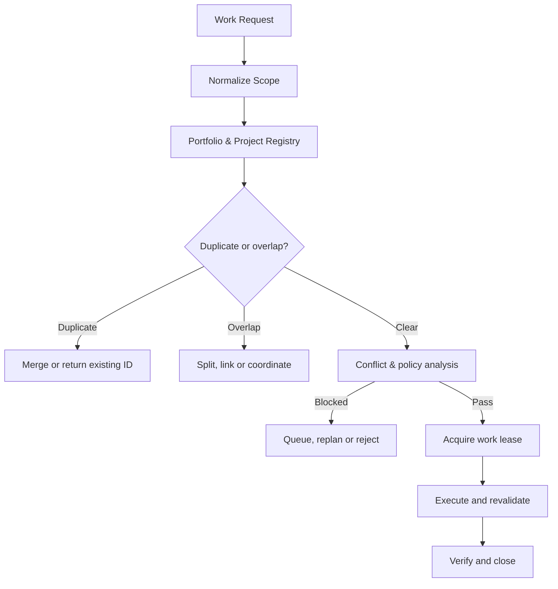

# WICG v1.0 — Work Intake, Deduplication & Conflict Guard

Status: **PROPOSED — NOT IN FORCE** until the operator's ratification merge of
the PR carrying `AGENTS.md` §32, and even then **binding only as §32 states**
(vocabulary + prohibitions now; machinery gated on implementation).
Provenance: supplied by the operator in session, 2026-08-11 (Thai/English
original); transcribed into the repository's working language by Claude
(BST-SA Motor). Where this document restates an in-force rule, the in-force
`AGENTS.md` section governs (§28.1 discipline).
Scope: **portfolio/control-plane** — designed to sit above every BST project
(bOPEN, SecB_PF, …), not inside any one of them. This copy is bOPEN's record;
identifier collisions are ruled in `AGENTS.md` §32.2.

## Executive recommendation

Install a central system in front of the Engineer Loop, upgrading the existing
rule:

> **No ticket, no work**

to:

> **No admitted ticket, no valid scope, no active lease — no work and no
> mutation.**

The system must live at the portfolio/control-plane level, not per-project;
otherwise duplicate work is caught only inside one project while changes that
collide with a shared service, API, database, governance policy, or another
project pass unseen. PMI recommends continuous strategic-alignment assessment
of portfolio items, not only at initiation; NIST SP 800-128 requires
configuration/change control with impact analysis before system change.

## 1. Four meanings, kept distinct

| Type | Meaning | Resolution |
| --- | --- | --- |
| `DUPLICATE` | Same objective, deliverables and acceptance criteria as existing work | Merge into the existing item or return the existing Work ID |
| `OVERLAP` | Shares some artifact or resource with existing work | Split the delta, coordinate, or create parent–child |
| `DEPENDENCY` | One item needs the other's output | Create `BLOCKED_BY` |
| `CONFLICT` | Outcomes, state transitions, or the resources themselves contradict | Serialize, replan, reject, or raise a decision ballot |

Overlap is not banned outright — independent validation, red-team review,
comparative spikes and rollback drills legitimately overlap — but must be
declared `INTENTIONAL_OVERLAP` with a reason and separation of duties.
GitHub's `blocked by`/`blocking` issue relationships are a presentation layer;
the central registry must also hold cross-repository and cross-project edges.

## 2. Architecture



Core components: Intake Gateway (issues `request_id`) · Scope Compiler (text →
objective, deliverables, read/write sets) · Global Work Registry (source of
truth across projects) · Project Contract Registry (scope, architecture, ADRs,
stage, freezes, prohibitions) · Duplicate Detector (exact, structural,
semantic) · Conflict Graph Engine (resource, interface, state, cross-project)
· Policy Decision Engine (authority, protected paths, prohibitions) · Lease
Manager (prevents concurrent mutation of one resource by multiple agents) ·
Scheduler (dependency, priority, capacity) · Evidence Ledger (append-only
record of admission, rejection, merges, takeovers).

## 3. Work intake lifecycle

```text
DRAFT → SUBMITTED → NORMALIZED → DUPLICATE_CHECKED → ALIGNMENT_CHECKED
→ CONFLICT_CHECKED → POLICY_CHECKED → ADMITTED → LEASED → IN_PROGRESS
→ VERIFYING → CLOSED
```

Additional parking/terminal states: `MERGED_INTO_EXISTING`,
`SPLIT_INTO_CHILD_WORK`, `BLOCKED_BY_DEPENDENCY`, `QUEUED_FOR_RESOURCE`,
`REPLAN_REQUIRED`, `REJECTED_DUPLICATE`, `REJECTED_POLICY`,
`EXTERNAL_AUTHORITY_REQUIRED`, `SUPERSEDED`, `CANCELLED`,
`LEASE_EXPIRED_RECOVERY`.

Work in `SUBMITTED` or `NORMALIZED` has **no right** to create branches, edit
files, deploy, or emit external actions.

## 4. Mandatory fields before admission

Every work item carries at minimum: `work_id`, `source_request_id`,
`project_id`, `portfolio_id`, `strategic_objective_id`; an `objective`,
`deliverables`, `acceptance_criteria`, `non_goals`; a `baseline`
(`commit_sha`, `policy_version`, `adr_versions`); `read_set`, `write_set`,
`interface_set`, `data_set`, `external_effects`, `protected_resources`;
`risk_class`, `authority_required`, `priority`. Worked example (identifiers
mapped to bOPEN's vocabulary — the original example used the portfolio's
`G4`/`L0` tokens, which are `AD4`/`GL-0` here per §30.4):

```yaml
work_id: BST-WORK-000123
source_request_id: REQUEST-8472
project_id: BOPEN
portfolio_id: BST
strategic_objective_id: OBJ-AUTONOMY-02
objective: "Make K-09 recomputable automatically"
deliverables: ["K-09 calculation script", "golden fixtures"]
acceptance_criteria:
  - "one observation per merged PR head"
  - "first downgrade terminates the series"
non_goals:
  - "does not change the autonomy threshold"
  - "no retroactive ledger edits"
baseline:
  commit_sha: "abc123"
  policy_version: "GL0-v1"
  adr_versions: ["ADR-019-v2"]
read_set: ["artifact:K09_LEDGER"]
write_set: ["repo:bopen/path:scripts/k09", "ci:job:k09-shadow"]
interface_set: []
data_set: ["metric:K09"]
external_effects: []
protected_resources: ["governance:AD4"]
risk_class: R2
authority_required: AGENT_CONTROLLED
priority: P1
```

If the `write_set` cannot be stated precisely, the item is
`SCOPE_INCOMPLETE` and MUST NOT be admitted.

## 5. Duplicate detection

### 5.1 Exact

Two separate keys:

```text
idempotency_key    = source_system + source_request_id
canonical_work_key = normalized_objective + deliverable_set
                     + target_asset_set + acceptance_contract_version
```

Rules: same `idempotency_key` → return the existing Work ID. Same
`canonical_work_key` with the existing item active → `MERGE_INTO_EXISTING`.
Existing item closed with a still-valid result → `SATISFIED_BY_EXISTING`.
Existing item closed but the baseline has moved → new item linked
`REVALIDATES`.

### 5.2 Semantic

LLM/embedding similarity **proposes candidates only** — it never rejects work
on its own authority. Starting weights:

```text
DuplicateScore = 0.30·Objective + 0.25·Deliverables + 0.20·Targets
               + 0.15·AcceptanceCriteria + 0.10·Baseline
```

| Result | Action |
| --- | --- |
| Exact key match | Auto-merge |
| Score ≥ 0.90 and target overlap ≥ 0.80 | `HOLD_FOR_CANONICALIZATION` |
| Score 0.65–0.89 | Inspect partial overlap |
| Score < 0.65 | Proceed to conflict analysis |

Thresholds must be calibrated against historical data, with
false-positive/false-negative rates always reported.

### 5.3 Delta rule

When new work genuinely adds something, never fold it wholesale into the
existing item: `NEW_SCOPE = REQUESTED_SCOPE − EXISTING_SCOPE`. Create only the
delta as child work referencing the existing result.

## 6. Conflict detection

For two active items `A`, `B`: `WW = A.write ∩ B.write` · `WR = A.write ∩
B.fresh_read` · `RW = A.fresh_read ∩ B.write` · `IC` incompatible
interface/schema changes · `SC` incompatible state transitions or ADR outcomes
· `PC` project/policy contradiction · `AC` authority conflict.

| Condition | Verdict (admission set) |
| --- | --- |
| Read–read only | `ACCEPT_PARALLEL` |
| Write–write on an exclusive resource | `QUEUE_SERIALIZED` |
| Write–read that stales a baseline | `BLOCKED_BY` / `REBASE_REQUIRED` |
| Shared API changed, consumers not ready | `INTEGRATION_PLAN_REQUIRED` |
| Two items propose divergent architectures | `OPTION_BALLOT_REQUIRED` |
| Contradicts PRD, ADR, or approved project state | `REPLAN_REQUIRED` |
| Exceeds the authority envelope | `AUTHORITY_BLOCKED` |
| Edits its own governance/authority | `EXTERNAL_AUTHORITY_REQUIRED` |
| Violates a hard policy | `POLICY_REJECTED` |

The resource catalog must be hierarchical (`database → schema → table →
column`); a lock at `schema:core` must collide with work editing
`table:property` even though the resource keys differ textually.

## 7. Mandatory prohibitions

1. No work without an `ADMITTED` Work ID and an active lease.
2. No admission without objective, deliverables, acceptance criteria,
   non-goals and baseline.
3. No two active duplicates without an intentional-overlap exception.
4. No two agents holding an exclusive write lease on one resource.
5. No shared API/schema/event-contract change without consumer-impact
   analysis.
6. No cross-project work without an integration contract.
7. No work contradicting PRD, ADR, stage gate, release freeze, or charter.
8. No splitting work into small tickets to evade risk class, WIP limits, or
   approval gates.
9. No renaming a request to evade the duplicate detector.
10. No takeover of an expired lease without recovery inspection.
11. No stale baseline after policy, ADR, or shared-dependency change.
12. No editing authority, classifier, quorum, or protected paths through
    ordinary work.
13. No deleting or replacing a prior intake verdict — corrections are
    append-only.
14. No proposer certifying the conflict clearance of its own high-risk work.
15. No auto-cancelling existing work merely because higher-priority work
    arrived — a supersession record and preservation plan are required.

## 8. Work lease

A lease binds: `work_id`, `agent_identity`, `project_id`, `resource_keys`,
`access_mode`, `branch_or_worktree`, `base_commit_sha`, `scope_version`,
`acquired_at`, `renewed_at`, `expires_at`. Access modes: `READ`,
`SHARED_WRITE`, `EXCLUSIVE_WRITE`, `STATE_TRANSITION`, `EXTERNAL_EFFECT`.

Model after Kubernetes Leases (holder identity, renew/expiry, single active
holder). **Lease expiry does not license takeover**: the successor must first
inspect branches, PRs, unmerged artifacts and external effects. PostgreSQL
transactions + advisory locks are a suitable implementation substrate for
application-defined resources.

## 9. Admission verdicts (a distinct vocabulary set)

`ACCEPT_PARALLEL` · `ACCEPT_INTENTIONAL_OVERLAP` · `RETURN_EXISTING_WORK` ·
`MERGE_INTO_EXISTING` · `SPLIT_DELTA_AND_LINK` · `LINK_AS_DEPENDENCY` ·
`QUEUE_SERIALIZED` · `COORDINATION_PLAN_REQUIRED` · `OPTION_BALLOT_REQUIRED` ·
`REPLAN_REQUIRED` · `POLICY_REJECTED` · `EXTERNAL_AUTHORITY_REQUIRED`.

The system may emit **only** these. This is the *admission-verdict* set —
separate from authority verdicts (GL constitution), EBIV ballot verdicts, and
operator dispositions. Always name the set.

## 10. Policy & audit

Final admission verdicts come from OPA or a deterministic policy engine; the
LLM only normalizes scope and proposes candidates. Every decision log carries:
`decision_id`, `work_id`, `input_snapshot_hash`, `active_work_snapshot`,
`project_contract_version`, `policy_bundle_version`, `duplicate_candidates`,
`conflict_edges`, `verdict`, `reason_codes`, `actor_id`, `timestamp`.
GitHub Actions concurrency groups may mirror resource leases at the
CI/deployment layer but must never serve as the Global Work Registry (scope is
workflow/repository only).

## 11. KPIs

| KPI | Definition |
| --- | --- |
| `WI-01` Exact Duplicate Prevented | exact duplicates stopped before execution |
| `WI-02` Duplicate Precision | confirmed duplicates / duplicate candidates |
| `WI-03` Conflict Escape Rate | conflicts found after start / admitted items |
| `WI-04` False Block Rate | wrongly blocked / all blocked |
| `WI-05` Admission Lead Time | p50/p95 submitted → admitted |
| `WI-06` Resource Contention Time | wait time for exclusive lease |
| `WI-07` Cross-project Rework | rework from cross-project conflict |
| `WI-08` Stale Baseline Rate | items re-admitted for baseline change |
| `WI-09` Orphan Lease Rate | leases expiring without closure/handover |
| `WI-10` Unauthorized Start | work started before admission; **target zero** |

Every KPI is computed from the event ledger with a reproducible query — never
remembered or copied from a prior report.

## 12. Implementation roadmap

1. Global Work Registry + Project Contract Registry.
2. Resource taxonomy for repo, service, API, DB, environment, governance.
3. Exact duplicate detection + idempotency first.
4. Dependency graph + exclusive leases.
5. Semantic detection in `SHADOW` mode to tune thresholds.
6. Cross-project conflict + baseline revalidation enforcement.
7. Wire GitHub Issues/PRs, CI concurrency, OPA decision logs.
8. Autonomous admission only for the lowest risk classes; higher classes go
   to a decision ballot under the authority policy.

Closing principle:

> **One outcome has one canonical work item; related work is linked; work
> sharing resources has ownership; and work contradicting the project
> contract does not pass the admission gate.**
