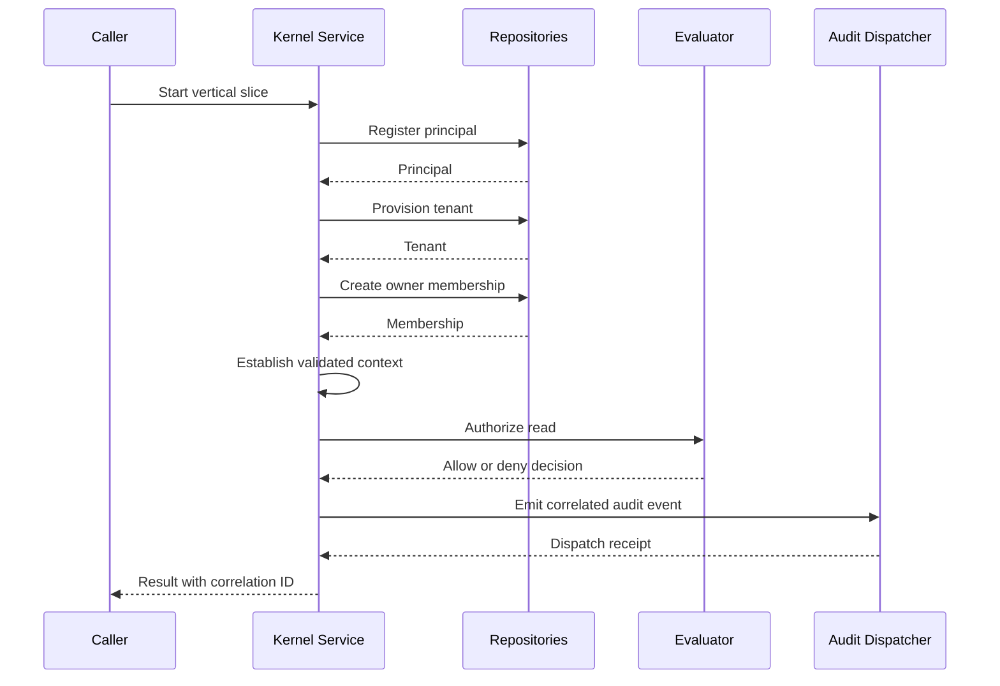

# BOPEN-P1-001 — Platform Kernel Vertical Slice Execution Plan

**Version:** 0.1  
**Date:** 2026-07-28  
**Document class:** Pre-coding implementation control  
**Phase:** Phase 1 — Platform Kernel Vertical Slice  
**Status:** PROPOSED / READY FOR REVIEW  
**Implementation status:** NOT VERIFIED IN THIS WORKSPACE  
**Owner:** Engineering Authority  
**Approval authority:** To be assigned  
**Target release:** Internal kernel baseline  

## 1. Executive decision

Phase 1 will establish the smallest end-to-end, tenant-aware, deny-by-default platform kernel:

> Register Principal → Provision Tenant → Create Owner Membership → Establish Context → Authorize Read → Emit Audit Event

The phase is intentionally limited to identity references, tenant boundaries, membership relationships, request context, authorization decisions, orchestration, and correlated audit evidence. Billing, generic workflow engines, industry modules, user interfaces, external identity-provider integration, and production deployment are excluded.

No coding should begin until the entry gate, contract decisions, identifiers, state transitions, authorization rules, audit requirements, and verification matrix in this document are approved.

## 2. Status interpretation

The supplied phase description labels the phase “COMPLETED & BUILT.” That status must be treated as an assertion until implementation evidence is inspected.

| State | Meaning | Required evidence |
|---|---|---|
| PLANNED | Scope and contracts approved | Approved execution plan and ADRs |
| IN_PROGRESS | Authorized implementation has started | Work package and repository baseline |
| IMPLEMENTED | Deliverables exist and local checks pass | Source files, test results, static checks |
| VERIFIED | Independent reviewer reproduces results | Review receipt and evidence manifest |
| COMPLETED | All exit gates pass and authority accepts | Signed/recorded completion decision |

Current document status is **PLANNED CANDIDATE**, not proof of implementation or completion.

## 3. Business and platform outcome

Phase 1 demonstrates that bOPEN can safely execute one governed relationship chain across a global principal and an isolated tenant.

### 3.1 Value proposition

- Establish a reusable kernel for every later bOPEN industry module.
- Make tenant isolation an invariant rather than an application convention.
- Centralize authorization decisions through a deny-by-default policy boundary.
- Create traceable evidence for both allowed and denied access.
- Minimize irreversible architecture decisions while proving the core control plane.

### 3.2 Measurable outcomes

1. A principal can be registered with a globally unique immutable identifier.
2. A tenant can be provisioned with a unique immutable identifier and active lifecycle state.
3. Exactly one initial owner membership can be established during provisioning.
4. A tenant-scoped context can be derived only from validated principal, tenant, and membership records.
5. A read request is allowed only when an explicit policy rule matches.
6. Missing, invalid, cross-tenant, inactive, or unsupported inputs are denied.
7. Every authorization attempt produces a correlated audit event.
8. The full happy path and required negative paths pass deterministically.
9. The service can be tested without billing, workflow, UI, external IAM, or industry dependencies.

## 4. Scope boundary

### 4.1 In scope

- Domain types for Principal, Tenant, Membership, ContextPayload, AuthorizationRequest, and AuthorizationDecision.
- Validated identifiers, timestamps, states, roles, actions, and resource descriptors.
- Relationship-based and attribute-based authorization evaluation.
- Deny-by-default behavior.
- Tenant-bound owner membership.
- Correlation and causation identifiers.
- Structured security audit events.
- A platform-kernel service orchestrating the full vertical slice.
- Deterministic in-memory repositories or ports suitable for Phase 1 testing.
- Unit, contract, integration, isolation, and negative-path tests.
- Documentation, decision records, test evidence, and completion gates.

### 4.2 Explicitly out of scope

- Authentication protocols, passwords, MFA, passkeys, SSO, OAuth, OIDC, or SCIM.
- User profile management beyond the kernel Principal record.
- Invitations, membership transfer, delegated administration, or multiple owner policies.
- Billing, subscription, invoicing, metering, plans, and entitlements.
- Generic workflow or approval engines.
- Industry-specific resources, rules, or data models.
- Persistent production database design and migrations.
- Message brokers, distributed transactions, or production event streaming.
- Web, mobile, or administrative user interfaces.
- Public API gateway and network transport.
- Production deployment, scaling, backup, recovery, or service-level commitments.

Any requested addition must be recorded as a scope-change proposal and assessed for impact on tests, authority, and exit criteria.

## 5. Governing principles and invariants

### 5.1 Mandatory principles

- **Deny by default:** no explicit match means deny.
- **Tenant boundary first:** tenant mismatch is evaluated before role or attribute grants.
- **No implicit owner power:** owner permissions are explicit policy rules.
- **Immutable identity:** primary identifiers are not reused or reassigned.
- **Validated context:** caller-supplied claims are not trusted without kernel validation.
- **Complete decision evidence:** both allow and deny decisions are audited.
- **Deterministic evaluation:** identical validated inputs and policy version produce the same decision.
- **No hidden side effects:** authorization evaluates; orchestration performs approved mutations.
- **Minimum disclosure:** decisions and audit records avoid unnecessary sensitive data.
- **Fail closed:** validation, repository, policy, or audit-precondition failures cannot result in allow.

### 5.2 Domain invariants

| ID | Invariant |
|---|---|
| INV-P1-001 | Principal ID is globally unique, immutable, and non-empty. |
| INV-P1-002 | Tenant ID is globally unique, immutable, and non-empty. |
| INV-P1-003 | Membership binds exactly one principal to exactly one tenant. |
| INV-P1-004 | Active membership uniqueness is enforced for principal + tenant. |
| INV-P1-005 | Initial owner membership is created only for the provisioning principal. |
| INV-P1-006 | Context principal, tenant, and membership must resolve to the same relationship chain. |
| INV-P1-007 | Resource tenant must equal context tenant for tenant-scoped access. |
| INV-P1-008 | Only active principals, tenants, and memberships may receive an allow decision. |
| INV-P1-009 | Unknown action, resource type, role, state, or policy version is denied. |
| INV-P1-010 | Every decision has decision ID, correlation ID, policy version, reason code, and timestamp. |
| INV-P1-011 | Every evaluated request produces one terminal decision audit event. |
| INV-P1-012 | Audit failure cannot silently convert a denied or errored operation into success. |

## 6. Target package and file boundary

The expected implementation boundary is:

```text
kernel_core/
├── __init__.py
├── types.py
├── evaluator.py
└── audit.py

platform_kernel/
├── __init__.py
└── service.py

tests/
├── unit/
│   ├── test_types.py
│   ├── test_evaluator.py
│   └── test_audit.py
└── integration/
    └── test_phase1_vertical_slice.py
```

The user-specified deliverables remain mandatory:

- `kernel_core/types.py`
- `kernel_core/evaluator.py`
- `kernel_core/audit.py`
- `platform_kernel/service.py`
- `test_phase1_vertical_slice.py`

Additional files may be introduced only when they clarify ports, test fixtures, package exports, or documented decisions without expanding the phase.

## 7. End-to-end execution contract



### 7.1 Success transaction

1. Accept a command containing idempotency key, correlation ID, principal registration data, and tenant provisioning data.
2. Validate command shape and supported values.
3. Register or deterministically return the same principal for a valid replay.
4. Provision or deterministically return the same tenant for a valid replay.
5. Create the initial owner membership, rejecting conflicting duplicates.
6. Resolve the persisted relationship chain.
7. construct a validated tenant context.
8. construct a read authorization request for a defined tenant-scoped resource.
9. evaluate the request against a pinned policy version.
10. emit a terminal authorization audit event.
11. return identifiers, authorization outcome, reason code, audit receipt, and correlation ID.

### 7.2 Failure contract

Every failure must:

- return or raise a typed, stable domain error;
- preserve the original correlation ID;
- avoid creating an allow decision;
- emit the required failure or deny audit event where an audit dispatcher is available;
- avoid leaking cross-tenant or sensitive record details;
- leave committed state consistent with the chosen Phase 1 transaction strategy.

## 8. Core domain contracts

### 8.1 Shared conventions

| Concern | Decision candidate |
|---|---|
| IDs | Opaque UUID-style values; never encode business meaning |
| Time | UTC, timezone-aware timestamps |
| Mutability | Frozen/immutable value objects where practical |
| Serialization | Explicit field mapping; no arbitrary object serialization |
| Enum handling | Closed enum; unknown values fail validation |
| Optional fields | Optional only when absence has defined semantics |
| Equality | Based on stable value fields, not object identity |
| Error model | Typed domain errors with stable machine-readable codes |

### 8.2 Principal

Purpose: kernel reference for an actor that may participate in tenant relationships.

Required fields:

| Field | Type/constraint | Notes |
|---|---|---|
| `principal_id` | Opaque identifier | Immutable primary identity |
| `principal_type` | Closed enum | Phase 1 default: `human` |
| `status` | `active`, `suspended`, `disabled` | Only active may be authorized |
| `external_ref` | Optional bounded string | Must not contain secrets |
| `created_at` | UTC timestamp | Set once |
| `version` | Positive integer | Supports optimistic evolution |

Rules:

- Duplicate `principal_id` with different data is a conflict.
- A replay with the same idempotency key and equivalent payload returns the original result.
- Principal registration does not authenticate the actor.

### 8.3 Tenant

Purpose: top-level isolation and policy boundary.

Required fields:

| Field | Type/constraint | Notes |
|---|---|---|
| `tenant_id` | Opaque identifier | Immutable |
| `name` | Normalized bounded string | Display value, not identity |
| `slug` | Normalized unique string | Optional if uniqueness strategy is deferred |
| `status` | `provisioning`, `active`, `suspended`, `closed` | Phase transition must be explicit |
| `created_by_principal_id` | Principal ID | Traceability only; not a grant |
| `created_at` | UTC timestamp | Set once |
| `version` | Positive integer | Concurrency support |

Rules:

- Provisioning must not create a tenant without a valid principal.
- Tenant activation and owner-membership creation must follow the selected atomicity strategy.
- Suspended or closed tenants always deny tenant-scoped reads.

### 8.4 Membership

Purpose: explicit relationship joining a principal and tenant.

Required fields:

| Field | Type/constraint | Notes |
|---|---|---|
| `membership_id` | Opaque identifier | Immutable |
| `tenant_id` | Tenant ID | Isolation boundary |
| `principal_id` | Principal ID | Relationship subject |
| `role` | Closed enum | Phase 1: `owner` only unless explicitly approved |
| `status` | `active`, `suspended`, `revoked` | Only active may authorize |
| `created_at` | UTC timestamp | Set once |
| `version` | Positive integer | Concurrency support |

Rules:

- The tenant/principal pair must be unique among active memberships.
- Role is an input to policy, not a hard-coded unconditional grant.
- Revoked memberships cannot be reactivated implicitly.

### 8.5 ContextPayload

Purpose: validated authorization context, created by the kernel rather than accepted as trusted caller input.

Required fields:

| Field | Type/constraint | Notes |
|---|---|---|
| `correlation_id` | Opaque identifier | Spans the execution chain |
| `principal_id` | Principal ID | Resolved principal |
| `tenant_id` | Tenant ID | Resolved tenant |
| `membership_id` | Membership ID | Resolved relationship |
| `roles` | Non-empty immutable set | Derived from active membership |
| `principal_status` | Closed enum | Snapshot for evaluation |
| `tenant_status` | Closed enum | Snapshot for evaluation |
| `membership_status` | Closed enum | Snapshot for evaluation |
| `issued_at` | UTC timestamp | Context creation time |
| `context_version` | Positive integer | Contract version |

Rules:

- IDs must match the same resolved relationship chain.
- Context must not accept caller-supplied roles as authoritative.
- Expiry is optional for Phase 1 but must be decided before implementation.

### 8.6 AuthorizationRequest

Purpose: normalized question sent to the evaluator.

Required fields:

| Field | Type/constraint | Notes |
|---|---|---|
| `request_id` | Opaque identifier | Unique evaluation reference |
| `correlation_id` | Opaque identifier | Must match context |
| `context` | `ContextPayload` | Validated context |
| `action` | Closed enum | Phase 1: `read` |
| `resource_type` | Closed enum/string registry | Phase 1 resource must be named |
| `resource_id` | Opaque identifier | Target identity |
| `resource_tenant_id` | Tenant ID | Required isolation check |
| `resource_attributes` | Bounded map | Allowlisted keys only |
| `requested_at` | UTC timestamp | Evaluation time |
| `policy_version` | Pinned version | Required determinism |

Rules:

- No arbitrary nested payloads.
- The resource tenant is mandatory for tenant-scoped resources.
- Unsupported actions or resource types are denied.

### 8.7 AuthorizationDecision

Purpose: immutable terminal authorization result.

Required fields:

| Field | Type/constraint | Notes |
|---|---|---|
| `decision_id` | Opaque identifier | Unique |
| `request_id` | Request ID | Links to request |
| `correlation_id` | Correlation ID | End-to-end trace |
| `effect` | `allow` or `deny` | No indeterminate public effect |
| `reason_code` | Stable closed code | Machine-readable |
| `policy_version` | Pinned version | Evidence |
| `evaluated_at` | UTC timestamp | Decision time |
| `matched_rule_ids` | Immutable tuple | Empty on default deny |
| `obligations` | Bounded tuple | Phase 1 normally empty |

Minimum reason codes:

- `ALLOW_EXPLICIT_OWNER_READ`
- `DENY_DEFAULT`
- `DENY_INVALID_CONTEXT`
- `DENY_PRINCIPAL_INACTIVE`
- `DENY_TENANT_INACTIVE`
- `DENY_MEMBERSHIP_INACTIVE`
- `DENY_TENANT_MISMATCH`
- `DENY_UNSUPPORTED_ACTION`
- `DENY_UNSUPPORTED_RESOURCE`
- `DENY_POLICY_VERSION`
- `DENY_EVALUATION_ERROR`

## 9. Authorization evaluator specification

### 9.1 Evaluation order

The evaluator must apply rules in a stable order:

1. Validate request and context contract.
2. Confirm supported policy version.
3. Confirm correlation consistency.
4. Confirm principal is active.
5. Confirm tenant is active.
6. Confirm membership is active.
7. Confirm context relationship IDs are coherent.
8. Confirm resource tenant equals context tenant.
9. Confirm action is supported.
10. Confirm resource type is supported.
11. Evaluate explicit relationship rule.
12. Evaluate approved resource attributes, if any.
13. Return allow only when all mandatory conditions and an explicit grant rule match.
14. Otherwise return default deny.

### 9.2 Phase 1 policy rule

Policy candidate `P1-KERNEL-OWNER-READ-v1`:

```text
ALLOW when:
  principal.status == active
  AND tenant.status == active
  AND membership.status == active
  AND membership.role contains owner
  AND context.tenant_id == resource.tenant_id
  AND action == read
  AND resource.type is in the Phase 1 allowlist
  AND policy_version == P1-KERNEL-OWNER-READ-v1
OTHERWISE DENY
```

The precise Phase 1 resource type must be approved before coding. Recommended neutral choice: `tenant_profile`.

### 9.3 ReBAC and ABAC boundary

- ReBAC inputs: principal → membership → tenant relationship.
- ABAC inputs: statuses, action, resource type, resource tenant, and approved resource attributes.
- Attributes cannot override a failed relationship or tenant boundary.
- The evaluator must be pure or observationally pure: it does not mutate repositories or dispatch audit events.

## 10. Audit dispatcher specification

### 10.1 Required event types

- `principal.registered`
- `tenant.provisioned`
- `membership.owner_created`
- `context.established`
- `authorization.allowed`
- `authorization.denied`
- `kernel.vertical_slice_failed`

### 10.2 Audit envelope

| Field | Requirement |
|---|---|
| `event_id` | Globally unique |
| `event_type` | Versioned allowlisted value |
| `event_version` | Positive integer |
| `occurred_at` | UTC timestamp |
| `correlation_id` | Required across the chain |
| `causation_id` | Links event to command or prior event |
| `actor_principal_id` | Required where known |
| `tenant_id` | Required for tenant-scoped events |
| `subject_type` / `subject_id` | Identifies affected object |
| `outcome` | `success`, `deny`, or `failure` |
| `reason_code` | Stable machine-readable code |
| `policy_version` | Required for authorization events |
| `metadata` | Bounded, allowlisted, non-secret values |
| `integrity_version` | Audit schema/integrity contract version |

### 10.3 Audit guarantees

- Authorization events are emitted for allow and deny.
- Event ordering is deterministic within one in-process execution.
- Dispatcher returns a receipt containing event ID and dispatch status.
- Raw secrets, passwords, tokens, or full unbounded request bodies are prohibited.
- Phase 1 may use an in-memory sink, but the dispatcher contract must permit later durable adapters.
- The implementation must explicitly decide whether audit dispatch is required before the service returns success.

Recommended Phase 1 rule: terminal authorization audit dispatch is mandatory. If it cannot be dispatched, return a controlled failure and never report the read as successfully authorized.

## 11. Platform Kernel Service specification

### 11.1 Responsibilities

- Validate orchestration command.
- Apply idempotency rules.
- coordinate repositories and domain factories.
- create the relationship chain.
- derive validated context.
- submit the authorization request.
- dispatch audit events.
- return a stable result contract.

### 11.2 Non-responsibilities

- Authenticate credentials.
- Embed policy logic that belongs in the evaluator.
- Persist audit events directly.
- Expose database implementation details.
- Grant permissions through provisioning shortcuts.
- Convert failures to allows.

### 11.3 Required ports

Before coding, approve minimal interfaces for:

- `PrincipalRepository`
- `TenantRepository`
- `MembershipRepository`
- `AuthorizationEvaluator`
- `AuditDispatcher`
- `Clock`
- `IdentifierFactory`

Optional:

- `UnitOfWork`, if atomic commit semantics are required.
- `IdempotencyStore`, if not safely represented through repositories.

### 11.4 Result contract

The successful vertical-slice result should contain:

- principal ID;
- tenant ID;
- owner membership ID;
- context version;
- authorization decision ID;
- authorization effect;
- reason code;
- policy version;
- audit receipt/event ID;
- correlation ID.

It must not return internal policy objects, mutable repositories, or sensitive attributes.

## 12. Atomicity and idempotency decision

This is a pre-coding architecture gate.

### 12.1 Recommended Phase 1 approach

- Use a single in-memory unit of work for integration tests.
- Treat principal registration, tenant provisioning, and owner-membership creation as one provisioning transaction.
- Commit provisioning only when all three domain objects validate.
- Evaluate authorization after committed provisioning state is available.
- Require the terminal authorization audit receipt before returning overall success.

### 12.2 Replay rules

| Scenario | Required behavior |
|---|---|
| Same idempotency key, equivalent payload | Return same logical result; do not duplicate records |
| Same idempotency key, different payload | Conflict |
| Duplicate principal ID, different data | Conflict |
| Duplicate tenant ID or slug | Conflict |
| Duplicate active membership | Return existing equivalent relationship or conflict, per approved repository contract |
| Retry after pre-commit failure | Safe to retry |
| Retry after commit but audit failure | Must not duplicate domain records; should complete/reconcile audit deterministically |

The last scenario requires an explicit test even if the production outbox pattern is deferred.

## 13. Detailed work breakdown before coding

### WP-P1-00 — Authority and baseline

**Objective:** establish that implementation is permitted against an exact repository baseline.

Steps:

1. Identify repository, target branch, baseline commit, and allowed paths.
2. Name accountable maker, independent checker, and completion authority.
3. Confirm allowed operations: create files, modify files, run tests, commit, push, and open review.
4. Record scope exclusions and maximum remediation cycles.
5. Confirm no production activation is authorized by Phase 1 completion.

Exit evidence:

- approved work authorization;
- baseline receipt;
- clean/known worktree status;
- declared target files.

### WP-P1-01 — Contract freeze

**Objective:** approve domain and service contracts before implementation.

Steps:

1. Freeze identifier representation.
2. Freeze timestamps and clock injection.
3. Freeze enums and lifecycle states.
4. Approve Phase 1 resource type.
5. Approve reason-code catalog.
6. Approve context expiry decision.
7. Approve atomicity and idempotency semantics.
8. Approve audit failure behavior.

Exit evidence:

- contract review checklist;
- approved ADR set;
- no unresolved blocking design questions.

### WP-P1-02 — Test specification

**Objective:** define acceptance tests before application code.

Steps:

1. Translate every invariant into at least one test.
2. Define fixtures and deterministic ID/clock values.
3. Define happy-path expected object chain.
4. Define cross-tenant and inactive-state cases.
5. Define duplicate and replay cases.
6. Define audit correlation assertions.
7. Define mutation and branch coverage targets.

Exit evidence:

- reviewed test matrix;
- expected reason codes;
- traceability from requirement to test ID.

### WP-P1-03 — Core types

**Objective:** implement validated immutable domain contracts.

Planned file: `kernel_core/types.py`

Implementation order:

1. Shared identifiers and enums.
2. Domain validation errors.
3. Principal.
4. Tenant.
5. Membership.
6. ContextPayload.
7. AuthorizationRequest.
8. AuthorizationDecision.

Gate:

- type/unit tests pass;
- invalid construction paths fail deterministically;
- serialization contains no undeclared fields.

### WP-P1-04 — Evaluator

**Objective:** implement deterministic deny-by-default policy evaluation.

Planned file: `kernel_core/evaluator.py`

Implementation order:

1. Define evaluator interface.
2. Define policy version constant/registry.
3. Implement validation and ordered deny checks.
4. Implement explicit owner-read rule.
5. Implement default deny.
6. Ensure internal errors produce deny reason, not allow.

Gate:

- every deny reason is tested;
- cross-tenant requests always deny;
- unknown values always deny;
- evaluator performs no writes.

### WP-P1-05 — Audit dispatcher

**Objective:** emit bounded, correlated security audit evidence.

Planned file: `kernel_core/audit.py`

Implementation order:

1. Define event envelope and receipt.
2. Define dispatcher and sink interfaces.
3. Implement Phase 1 sink adapter.
4. Validate event types and metadata.
5. Implement ordered dispatch and typed failures.
6. Test redaction/prohibited fields.

Gate:

- allow and deny events are covered;
- correlation, causation, and policy version are asserted;
- dispatch failure behavior matches the approved contract.

### WP-P1-06 — Kernel service

**Objective:** orchestrate the complete vertical slice.

Planned file: `platform_kernel/service.py`

Implementation order:

1. Define command and result contracts.
2. Inject ports, clock, and identifier factory.
3. Implement registration.
4. Implement tenant provisioning.
5. Implement owner membership creation.
6. Implement validated context construction.
7. Implement read authorization.
8. Implement audit dispatch.
9. Implement idempotent replay and failure mapping.

Gate:

- service does not duplicate evaluator policy;
- orchestration order is testable;
- partial failures comply with atomicity rules.

### WP-P1-07 — Integration and isolation suite

**Objective:** verify the system behavior, not only individual classes.

Mandatory file: `test_phase1_vertical_slice.py`

Integration assertions:

1. Principal is registered.
2. Tenant is provisioned.
3. Owner membership binds the same principal and tenant.
4. Context contains only resolved relationship claims.
5. Owner read is explicitly allowed.
6. Decision and all events share the correlation ID.
7. Policy version and matched rule are recorded.
8. Cross-tenant resource substitution is denied.
9. Inactive principal, tenant, or membership is denied.
10. Unsupported action and resource are denied.
11. Replay does not duplicate records or audit semantics unexpectedly.
12. Audit failure does not yield reported authorization success.

Gate:

- suite passes repeatedly with deterministic fixtures;
- no test depends on execution order or network access.

### WP-P1-08 — Independent verification and closure

**Objective:** establish reproducible completion evidence.

Steps:

1. Run formatting, linting, type checks, unit tests, and integration tests.
2. Capture tool versions and exact commands.
3. Record source commit and tree identifiers.
4. Review scope diff for unauthorized additions.
5. Independently reproduce the test results.
6. Map exit criteria to evidence.
7. Record completion decision or unresolved exceptions.

Exit evidence:

- evidence manifest;
- machine-readable test output;
- independent review receipt;
- completion decision.

## 14. Test and verification matrix

| Test ID | Scenario | Expected effect | Expected reason/event |
|---|---|---|---|
| P1-T001 | Valid principal registration | Success | `principal.registered` |
| P1-T002 | Duplicate equivalent registration replay | Idempotent success | No duplicate principal |
| P1-T003 | Duplicate conflicting principal | Failure | Typed conflict |
| P1-T004 | Valid tenant provisioning | Success | `tenant.provisioned` |
| P1-T005 | Owner membership chain | Success | `membership.owner_created` |
| P1-T006 | Valid context chain | Success | `context.established` |
| P1-T007 | Owner reads same-tenant profile | Allow | `ALLOW_EXPLICIT_OWNER_READ` |
| P1-T008 | No matching role/rule | Deny | `DENY_DEFAULT` |
| P1-T009 | Cross-tenant resource | Deny | `DENY_TENANT_MISMATCH` |
| P1-T010 | Suspended principal | Deny | `DENY_PRINCIPAL_INACTIVE` |
| P1-T011 | Suspended tenant | Deny | `DENY_TENANT_INACTIVE` |
| P1-T012 | Revoked membership | Deny | `DENY_MEMBERSHIP_INACTIVE` |
| P1-T013 | Unsupported action | Deny | `DENY_UNSUPPORTED_ACTION` |
| P1-T014 | Unsupported resource | Deny | `DENY_UNSUPPORTED_RESOURCE` |
| P1-T015 | Unknown policy version | Deny | `DENY_POLICY_VERSION` |
| P1-T016 | Tampered context relationship | Deny | `DENY_INVALID_CONTEXT` |
| P1-T017 | Evaluator internal exception | Deny/failure | `DENY_EVALUATION_ERROR` |
| P1-T018 | Allow audit event | Success | Correlated allow event |
| P1-T019 | Deny audit event | Success | Correlated deny event |
| P1-T020 | Audit sink failure | Controlled failure | No reported successful read |
| P1-T021 | Full command replay | Idempotent | No duplicate domain chain |
| P1-T022 | Correlation mismatch | Deny | `DENY_INVALID_CONTEXT` |

### 14.1 Quality thresholds

- 100% of listed invariants covered by tests.
- 100% of evaluator reason codes exercised.
- 100% branch coverage targeted for the evaluator.
- High branch coverage for domain validation and orchestration error paths.
- Zero network calls in Phase 1 tests.
- Zero nondeterministic wall-clock or random-ID dependencies in assertions.
- Static type checking passes at the project’s approved strictness.

Coverage percentage alone is not an exit criterion; behavioral and mutation coverage of security decisions is more important.

## 15. Security and privacy review

### 15.1 Threat cases

| Threat | Control |
|---|---|
| Cross-tenant ID substitution | Mandatory resource/context tenant equality |
| Caller-forged owner role | Roles derived from repository membership |
| Inactive entity reuse | State checks before grants |
| Unknown action treated permissively | Closed action set and default deny |
| Policy drift | Pinned and recorded policy version |
| Audit omission on deny | Terminal event required for every evaluation |
| Sensitive data in logs | Allowlisted audit fields and bounded metadata |
| Replay creates multiple owners | Idempotency key and uniqueness constraints |
| Evaluation error allows access | Fail-closed error mapping |
| Confused-deputy orchestration | Validated relationship chain and explicit resource tenant |

### 15.2 Data classification

- IDs: internal identifiers; avoid treating them as secrets.
- Principal external references: potentially personal; minimize and redact.
- Roles and tenant associations: confidential authorization data.
- Audit events: security-sensitive and integrity-relevant.
- Credentials and tokens: prohibited from all Phase 1 models and logs.

## 16. Observability

Phase 1 observability is limited to structured, deterministic diagnostic signals:

- operation name;
- correlation ID;
- outcome;
- stable reason/error code;
- elapsed duration, if a deterministic test clock strategy is not required;
- audit dispatch status.

Logging must not become an alternative audit trail. Audit events have a defined schema and security purpose; diagnostic logs remain operational and may be sampled or disabled.

## 17. Architecture decision records required

Before coding, record at minimum:

| ADR | Decision |
|---|---|
| ADR-P1-001 | Identifier and timestamp conventions |
| ADR-P1-002 | Domain immutability and validation model |
| ADR-P1-003 | Deny-by-default ReBAC/ABAC evaluation order |
| ADR-P1-004 | Tenant context derivation and trust boundary |
| ADR-P1-005 | Audit dispatch and failure semantics |
| ADR-P1-006 | Phase 1 atomicity and idempotency |
| ADR-P1-007 | Repository ports and in-memory adapter boundary |
| ADR-P1-008 | Phase 1 policy/resource allowlist |

Each ADR should include context, decision, alternatives, consequences, status, owner, and approval record.

## 18. Roles and separation of duties

| Role | Accountability |
|---|---|
| Product/Platform Owner | Confirms phase value and exclusions |
| Engineering Authority | Approves contracts and architecture |
| Maker | Implements only approved work packages |
| Independent Checker | Reviews security behavior and reproduces tests |
| Security Reviewer | Reviews tenant isolation, deny behavior, and audit schema |
| Completion Authority | Accepts or rejects phase exit evidence |

The maker must not be the sole approver of completion.

## 19. Entry gate

Coding may start only when all items are true:

- [ ] Repository and exact baseline are identified.
- [ ] Phase scope and exclusions are approved.
- [ ] Responsible maker and independent checker are named.
- [ ] Domain contracts and invariant catalog are approved.
- [ ] Phase 1 resource type and policy version are approved.
- [ ] Atomicity, idempotency, and audit-failure semantics are approved.
- [ ] Test matrix is reviewed.
- [ ] Toolchain and quality commands are frozen.
- [ ] Work paths and permitted operations are authorized.
- [ ] No unresolved blocking ADR remains.

Decision: **GO**, **GO WITH RECORDED CONDITIONS**, or **NO-GO**.

## 20. Definition of done and exit gate

Phase 1 is complete only when:

- [ ] All six domain models/contracts are implemented and validated.
- [ ] Evaluator is explicit-grant and deny-by-default.
- [ ] Cross-tenant access is proven denied.
- [ ] Audit dispatcher records correlated allow and deny events.
- [ ] Platform service completes the full execution chain.
- [ ] Integration suite includes all mandatory positive and negative paths.
- [ ] Formatting, linting, typing, unit, and integration checks pass.
- [ ] No billing, workflows, industry logic, UI, or external IAM entered the scope.
- [ ] Source and evidence are bound to exact commit/tree identifiers.
- [ ] Independent checker reproduces required results.
- [ ] Exceptions and technical debt are recorded with owners and target phases.
- [ ] Completion authority records acceptance.

Completion does **not** authorize production deployment or Phase 2 automatically.

## 21. Evidence package

Recommended closure structure:

```text
docs/evidence/phase-1/
├── manifest.json
├── baseline.md
├── scope-diff.txt
├── tool-versions.txt
├── format-result.txt
├── lint-result.txt
├── typecheck-result.txt
├── unit-test-result.txt
├── integration-test-result.txt
├── coverage-summary.txt
├── invariant-traceability.csv
├── security-review.md
├── independent-review.md
└── completion-decision.md
```

The manifest should bind:

- repository;
- branch;
- base commit/tree;
- implementation commit/tree;
- policy version;
- test commands;
- artifact paths;
- cryptographic digests;
- maker;
- checker;
- execution timestamps;
- final disposition.

## 22. Risks and controls

| Risk | Impact | Control | Owner |
|---|---|---|---|
| “Completed” declared without evidence | Governance and delivery ambiguity | State/evidence model and exit authority | Completion Authority |
| Role hard-coded as universal power | Future policy rigidity | Explicit versioned evaluator rules | Engineering |
| Caller-forged context | Authorization bypass | Resolve context from repositories | Security |
| Cross-tenant data exposure | Critical isolation failure | Tenant-first deny rule and negative tests | Security |
| Audit failure ignored | Incomplete accountability | Mandatory terminal dispatch contract | Engineering |
| In-memory design leaks into domain | Rework in later phases | Ports/adapters boundary | Architecture |
| Scope expansion | Delayed vertical slice | Change control and exclusions | Platform Owner |
| Nondeterministic tests | Weak evidence | Inject clocks and ID factories | Maker |

## 23. Pre-coding decision register

The following values must be resolved:

| Decision ID | Question | Recommended default | Status |
|---|---|---|---|
| D-P1-001 | Phase 1 resource type? | `tenant_profile` | OPEN |
| D-P1-002 | Context expiry in Phase 1? | No expiry; versioned snapshot only | OPEN |
| D-P1-003 | Principal types? | `human` only | OPEN |
| D-P1-004 | Membership roles? | `owner` only | OPEN |
| D-P1-005 | Tenant slug required? | Yes, normalized unique | OPEN |
| D-P1-006 | Audit required before success? | Yes | OPEN |
| D-P1-007 | Provisioning atomicity? | Single in-memory unit of work | OPEN |
| D-P1-008 | Replay conflict semantics? | Same payload returns prior result; changed payload conflicts | OPEN |
| D-P1-009 | Policy identifier? | `P1-KERNEL-OWNER-READ-v1` | OPEN |
| D-P1-010 | Completion evidence location? | `docs/evidence/phase-1/` | OPEN |

## 24. Recommended implementation sequence after GO

1. Freeze ADRs and contract tables.
2. Write failing contract and invariant tests.
3. Implement domain types.
4. Verify validation tests.
5. Write evaluator negative-path tests.
6. Implement evaluator in ordered deny-first form.
7. Implement audit envelope and dispatcher contract.
8. Implement repository ports and deterministic adapters.
9. Implement kernel service orchestration.
10. Complete vertical-slice integration tests.
11. Run isolation, replay, audit-failure, and mutation checks.
12. Produce evidence package.
13. Perform independent review.
14. Record completion decision.

## 25. Phase-start recommendation

Recommended disposition:

**APPROVE FOR PHASE 1 PRE-CODING CONTRACT FREEZE**, subject to:

1. resolution of D-P1-001 through D-P1-010;
2. confirmation of repository baseline and authority;
3. approval of the test matrix and exit criteria;
4. preservation of the stated scope exclusions; and
5. no claim of “COMPLETED” until source, test, review, and decision evidence is verified.

The immediate next checkpoint is **WP-P1-01 — Contract Freeze**, not application coding.
