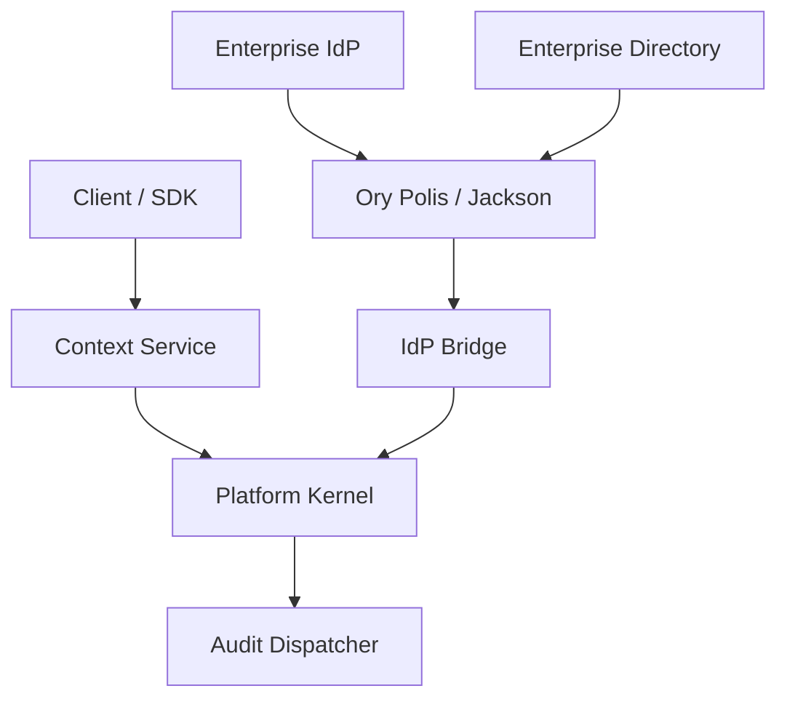

# BOPEN-P2-001 — Membership & Enterprise Onboarding Execution Plan

**Version:** 0.1  
**Date:** 2026-07-29  
**Document class:** Phase execution control and pre-coding work package  
**Phase:** Phase 2 — Membership & Enterprise Onboarding  
**Status:** APPROVED FOR CONTRACT FREEZE / IMPLEMENTATION NOT STARTED  
**Depends on:** Phase 0 completed; Phase 1 completed and verified; `BOPEN-IDP-001` approved  
**Owner:** Engineering Authority  
**Approval basis:** Explicit project direction dated 2026-07-29  
**Implementation authority:** Must be bound to an exact repository baseline before mutation  
**Production status:** NOT AUTHORIZED  

## 1. Executive decision

Phase 2 will convert the Phase 1 owner-only relationship chain into a governed enterprise onboarding capability:

> Invite Principal → Activate Membership → Authenticate through Enterprise IdP → Synchronize Directory State → Switch Tenant Context → Grant and Revoke Delegated Access → Emit Evidence

The phase is divided into five controlled milestones:

1. **MILE-2.1 — Principal Invitation Engine**
2. **MILE-2.2 — Membership State Machine Engine**
3. **MILE-2.3 — Tenant Context Switching Service**
4. **MILE-2.4 — Enterprise IdP & SCIM 2.0 Sync**
5. **MILE-2.5 — Delegated Cross-Tenant Access**

Coding begins only after the entry gate, ADRs, state-transition contract, API contracts, token/security profile, test matrix, repository baseline, and authority scope are frozen.

## 2. Phase objective

Establish a standards-based, tenant-isolated onboarding and membership control plane that supports enterprise SSO and directory-driven lifecycle automation without weakening the Phase 1 deny-by-default kernel.

### 2.1 Business outcome

- Enterprises can onboard users through invitation, SSO, and SCIM.
- Joiner, mover, and leaver events are automated and auditable.
- A user with multiple tenant relationships can switch context securely.
- Support and partner access is explicit, time-bounded, and revocable.
- SDK consumers receive one stable identity/context contract across products.

### 2.2 Measurable outcomes

| KPI | Phase 2 target |
|---|---|
| Membership transition coverage | 100% of allowed and forbidden transitions |
| Invitation terminal-state determinism | 100% |
| Cross-tenant negative-path pass rate | 100% |
| Token claim/invariant coverage | 100% |
| SCIM replay safety | No duplicate Principal or Membership for equivalent replay |
| Deprovision behavior | New context issuance denied immediately after committed deprovision |
| Delegated access expiry | Automatic; no manual cleanup required |
| Security-relevant event coverage | 100% of cataloged Phase 2 operations |
| Prohibited secret/token leakage | Zero findings in test logs and evidence |

## 3. Scope

### 3.1 In scope

- Invitation issue, validate, accept, decline, and expiry.
- Complete Membership state transition handler.
- Enforcement of `membership-transition.json`.
- Tenant context-switch API and token rotation.
- TypeScript and Python SDK context-switch extensions.
- Enterprise SSO broker adapter for SAML and OIDC.
- SCIM 2.0 Users and Groups synchronization.
- External identity linking under `BOPEN-IDP-001`.
- Time-bounded partner and support access grants.
- Audit events, observability, security review, tests, and evidence.

### 3.2 Out of scope

- Phase 3 entitlement catalog or licensing.
- Billing, subscriptions, invoices, plans, or metering.
- Industry-module roles or permissions.
- Full administrative UI.
- Password database or consumer identity platform.
- Production topology, production secrets, or production activation.
- HR information-system ownership.
- Infrastructure privileged-access management.
- Generic workflow engine.

Scope additions require a recorded impact assessment and approval.

## 4. Governing artifacts

| Artifact | Role |
|---|---|
| `BOPEN-IDP-001` | Identity, federation, SCIM, token, and delegation standard |
| `membership-transition.json` | Machine-readable membership transition authority |
| Phase 1 kernel contracts | Principal, Tenant, Membership, Context, authorization, audit |
| Phase 0 governance | Authority, separation of duties, evidence, phase gates |
| ADR-P2-001 through ADR-P2-010 | Pre-coding architecture decisions |
| This document | Scope, sequence, verification, evidence, and exit control |

If artifacts conflict, implementation stops until the conflict is resolved through the approved governance mechanism.

## 5. Mandatory invariants

| ID | Invariant |
|---|---|
| INV-P2-001 | An invitation belongs to exactly one tenant and normalized destination. |
| INV-P2-002 | A raw invitation token is returned once and never persisted. |
| INV-P2-003 | Invitation acceptance is single-use and atomic with membership activation. |
| INV-P2-004 | Expired, declined, or consumed invitations cannot be accepted. |
| INV-P2-005 | Every membership transition must be present in `membership-transition.json`. |
| INV-P2-006 | Terminal membership states cannot reactivate implicitly. |
| INV-P2-007 | Only active membership or active delegated grant permits tenant-context issuance. |
| INV-P2-008 | Context tokens contain one coherent `sub`/`tid`/`mid` chain. |
| INV-P2-009 | Roles and scopes are derived from authoritative bOPEN state. |
| INV-P2-010 | Context switching never copies authorization data from the prior tenant. |
| INV-P2-011 | External `(connection, issuer, subject)` identity is unique and immutable. |
| INV-P2-012 | Email equality alone cannot link Principals. |
| INV-P2-013 | SCIM replay cannot create duplicate logical identities or memberships. |
| INV-P2-014 | A stale SCIM update cannot reactivate a later deprovisioned membership. |
| INV-P2-015 | Delegated access is tenant-specific, scope-bounded, and time-bounded. |
| INV-P2-016 | Revoked or expired delegation cannot issue a context token. |
| INV-P2-017 | All security-relevant success, deny, and failure outcomes are audited. |
| INV-P2-018 | No raw credential, assertion, authorization code, or token is logged or evidenced. |

## 6. Target implementation boundary

Required files:

```text
packages/kernel-core/python/kernel_core/
└── membership.py

services/platform-kernel/python/platform_kernel/
└── idp_bridge.py

sdk/typescript/src/
├── context.ts
└── index.ts

sdk/python/bopen_sdk/
├── context.py
└── __init__.py

tests/integration/
└── test_phase2_membership_onboarding.py

docs/evidence/phase-2/
└── ...
```

Expected supporting files, subject to repository convention:

```text
contracts/
├── membership-transition.json
├── invitation.schema.json
├── context-switch.schema.json
├── scim-event.schema.json
└── delegated-grant.schema.json

tests/unit/
├── test_invitation_engine.py
├── test_membership_state_machine.py
├── test_context_switch.py
├── test_idp_bridge.py
└── test_delegated_access.py
```

Additional files are permitted only for ports, adapters, package exports, fixtures, migrations, or documentation needed to implement these contracts without expanding scope.

## 7. Architecture boundary



### 7.1 Ownership

| Component | Owns | Must not own |
|---|---|---|
| Broker | SAML/OIDC/SCIM protocol handling | bOPEN roles, scopes, membership authority |
| IdP bridge | Normalization, tenant binding, mapping, replay guard | Direct permission grants |
| Membership engine | Invitation and membership lifecycle | Protocol secrets |
| Context service | Context validation and token rotation | Long-lived authorization cache |
| Kernel evaluator | Deny-by-default authorization | Protocol-specific parsing |
| SDKs | Safe request formation and response handling | Trusting local role/tenant state |

## 8. Milestone dependency model

| Milestone | Depends on | Unlocks |
|---|---|---|
| MILE-2.1 Invitation | Phase 1 types, invitation contract | Controlled self-service onboarding |
| MILE-2.2 Membership | Phase 1 Membership, transition contract | Context, SCIM, delegation lifecycle |
| MILE-2.3 Context | Active membership engine, token ADR | Multi-tenant sessions and SDK |
| MILE-2.4 IdP/SCIM | Identity standard, membership engine | Enterprise onboarding automation |
| MILE-2.5 Delegation | Membership and context services | Partner/support operations |

MILE-2.1 and MILE-2.2 contracts are frozen together. Implementation order is MILE-2.2 primitives first, then MILE-2.1 orchestration where atomic acceptance depends on the state machine.

## 9. MILE-2.1 — Principal Invitation Engine

### 9.1 Objective

Issue, validate, accept, decline, and expire tenant invitations with deterministic single-use behavior.

### 9.2 Commands

| Command | Required inputs | Terminal result |
|---|---|---|
| `IssueInvitation` | tenant, destination, bootstrap roles/scopes, inviter, expiry, idempotency | `invited` |
| `ValidateInvitation` | raw token, tenant/client context | Valid summary or typed denial |
| `AcceptInvitation` | raw token, authenticated/verified Principal, idempotency | invitation `active`; membership `active` |
| `DeclineInvitation` | raw token or authenticated invitation reference | `declined` |
| `ExpireInvitations` | cutoff time, bounded batch | eligible records `expired` |

### 9.3 Issue flow

1. Authenticate inviter and establish active tenant context.
2. Authorize `membership.invite`.
3. Validate normalized destination, bootstrap roles, scopes, and expiry bounds.
4. Check duplicate active invitation policy.
5. Generate invitation ID and cryptographically random raw token.
6. Persist only a versioned one-way token digest.
7. Persist invitation in `invited`.
8. Emit `invitation.issued`.
9. Return the raw token only through the approved delivery boundary.

### 9.4 Accept flow

1. Hash the supplied token using the approved versioned scheme.
2. Resolve the invitation using constant-time digest comparison where applicable.
3. Check `invited` state, time window, tenant/client binding, and token version.
4. Authenticate or securely establish the target Principal.
5. Apply the identity-linking rules from `BOPEN-IDP-001`.
6. Begin one transaction/unit of work.
7. Lock or compare-and-swap the invitation version.
8. Create or resolve the permitted membership relationship.
9. Transition membership from `invited` to `active`.
10. Transition invitation from `invited` to `active`.
11. Commit atomically.
12. Emit correlated `invitation.accepted` and `membership.transitioned`.
13. Return membership reference; context issuance is a separate authorized operation.

### 9.5 Failure rules

- Wrong, malformed, expired, consumed, declined, or tenant-mismatched token returns a generic typed denial without account enumeration.
- Equivalent replay after successful acceptance returns the prior logical outcome only when authenticated Principal and idempotency binding match.
- Conflicting replay is denied and audited.
- Audit/transaction failure follows the approved outbox or reconciliation ADR; it cannot create two memberships.

### 9.6 Deliverables

- Invitation domain contracts in `membership.py`.
- Repository and clock/random/token-hasher ports.
- Unit tests for every invitation state.
- Integration assertions in `test_phase2_membership_onboarding.py`.

### 9.7 Exit gate

- All invitation invariants pass.
- Token value never appears in persistence, logs, exceptions, snapshots, or evidence.
- Concurrency test proves only one acceptance wins.
- Expiry tests use injected time.
- Issue/accept/decline/expire audit events are correlated.

## 10. MILE-2.2 — Membership State Machine Engine

### 10.1 Objective

Implement a single authoritative membership transition handler driven by `membership-transition.json`.

### 10.2 State set

```text
invited
active
suspended
revoked
expired
left
removed
```

### 10.3 Required transition contract

Each transition definition contains:

```json
{
  "from": "active",
  "to": "suspended",
  "action": "membership.suspend",
  "allowed_actor_types": ["tenant_admin", "security_control", "scim_directory"],
  "required_conditions": ["tenant_active", "membership_version_match"],
  "terminal": false,
  "reason_codes": ["ADMIN_SUSPENSION", "SCIM_DEPROVISION", "SECURITY_HOLD"],
  "event_type": "membership.transitioned"
}
```

The exact schema is frozen during WP-P2-02. Code must load a pinned contract version and reject unknown states, actions, conditions, or reasons.

### 10.4 Transition algorithm

1. Validate command and correlation.
2. Resolve actor context and target tenant.
3. Load membership and compare expected version.
4. Confirm current state equals command `from_state`.
5. Resolve exact transition from the pinned contract.
6. Authorize the transition action.
7. Evaluate required conditions and terminal-state constraints.
8. Derive transition reason and effective time.
9. Persist new state and increment version atomically.
10. Trigger required session/context invalidation obligations.
11. Emit success or denial audit event.
12. Return immutable transition receipt.

### 10.5 Concurrency and idempotency

- Commands include expected membership version and idempotency key.
- Same key and equivalent payload returns the prior receipt.
- Same key and different payload conflicts.
- Competing version writes allow at most one commit.
- Session invalidation obligations are idempotent and retryable.

### 10.6 Side effects by target state

| Target state | Mandatory side effect |
|---|---|
| `active` | Eligible for context issuance after all checks |
| `suspended` | Deny new contexts; revoke/supersede active contexts |
| `revoked` | Permanent deny for relationship; revoke contexts and grants |
| `expired` | Deny new contexts; expire dependent grants |
| `left` | Deny new contexts; preserve audit relationship |
| `removed` | Deny new contexts; preserve non-reassignment tombstone |

### 10.7 Deliverables

- State machine and transition receipt in `membership.py`.
- Versioned `membership-transition.json`.
- Unit tests generated or parameterized from the contract.
- Negative test for every absent transition.

### 10.8 Exit gate

- 100% transition matrix coverage.
- Contract and implementation state sets match exactly.
- All forbidden transitions fail closed.
- Concurrency and replay behavior is deterministic.
- Non-active transition triggers context invalidation.

## 11. MILE-2.3 — Tenant Context Switching Service

### 11.1 Objective

Allow an authenticated Principal to switch active tenant context without re-authentication while revalidating every authorization input.

### 11.2 API contract

```text
POST /v1/session/context:switch
Headers:
  Authorization: Bearer <approved session or context credential>
  X-Tenant-ID: <requested tenant>
  X-Context-ID: <expected current context>
  Idempotency-Key: <opaque key>
```

The request body may repeat `tenant_id` and `expected_context_id`. If both header and body values are supported, mismatches are denied.

### 11.3 Service algorithm

1. Validate authentication session, credential type, signature, issuer, audience, time, and client binding.
2. Validate CSRF protection for browser clients.
3. Parse requested tenant and expected context as untrusted selectors.
4. Resolve current server-side session and Principal.
5. Resolve target Tenant without revealing unauthorized tenant data.
6. Resolve active target Membership.
7. If no active membership exists, evaluate active delegated grant.
8. Derive roles and scopes from target-tenant state.
9. Create new context ID and token claims.
10. Sign a short-lived tenant-bound token.
11. Supersede the previous context according to ADR-P2-005.
12. emit `context.switched`.
13. Return token and expiry through the approved channel.

### 11.4 SDK contract

TypeScript:

```ts
type SwitchContextRequest = {
  tenantId: string;
  expectedContextId?: string;
  idempotencyKey: string;
};

type TenantContext = {
  contextId: string;
  tenantId: string;
  membershipId: string;
  expiresAt: string;
};

switchTenantContext(input: SwitchContextRequest): Promise<TenantContext>;
```

Python:

```python
@dataclass(frozen=True)
class SwitchContextRequest:
    tenant_id: str
    idempotency_key: str
    expected_context_id: str | None = None

def switch_tenant_context(request: SwitchContextRequest) -> TenantContext:
    ...
```

SDKs:

- set approved headers consistently;
- never decode tokens to make authorization decisions;
- avoid logging tokens;
- surface typed error codes;
- support caller-provided idempotency;
- clear or replace cached context only after a successful response.

### 11.5 Denial cases

- inactive Principal, Tenant, or Membership;
- unknown tenant;
- cross-principal membership;
- stale expected context;
- conflicting header/body tenant;
- expired/revoked authentication session;
- insufficient authentication assurance;
- expired/revoked delegated grant;
- unknown signing key or invalid token claims;
- role/scope derivation failure;
- audit/token issuance failure.

### 11.6 Exit gate

- Same-tenant and cross-tenant scenarios pass.
- Old tenant roles/scopes never appear in new context.
- Header tampering has no authorization effect.
- SDK contract tests pass in both languages.
- Revocation and membership-state changes prevent issuance.

## 12. MILE-2.4 — Enterprise IdP & SCIM 2.0 Sync

### 12.1 Objective

Integrate bOPEN with enterprise SAML/OIDC and SCIM through a protocol broker adapter while preserving kernel authority.

### 12.2 Technology boundary

The planned broker is BoxyHQ Jackson, now Ory Polis, or a pinned conformant successor. The exact version, deployment mode, database, API authentication, callback URLs, SAML audience, OIDC path, SCIM path, key material, and feature flags are frozen in ADR-P2-001 and the environment contract.

No floating `latest` dependency or undocumented broker API is permitted.

### 12.3 `idp_bridge.py` responsibilities

- Parse normalized broker callbacks/events.
- Authenticate the broker or validate signed callback evidence.
- Resolve exact connection/directory and tenant.
- Validate replay/idempotency keys and event time.
- Normalize stable subject and approved profile attributes.
- Apply identity-linking rules.
- Call the membership engine for provisioning/deprovisioning.
- Apply versioned group-to-role mappings.
- Request context issuance only after kernel validation.
- Emit bounded audit evidence.

It must not:

- persist raw credentials or assertions;
- treat broker roles/groups as direct permissions;
- infer a tenant from email domain alone;
- bypass membership state transitions;
- issue unsigned or unbounded tokens.

### 12.4 SSO flows

#### SAML/OIDC initiation

1. Resolve tenant/product login intent.
2. Resolve active connection.
3. Create state, nonce, PKCE, and correlation values as required.
4. Persist bounded single-use transaction state.
5. Redirect through broker.

#### Callback

1. Validate callback authenticity and transaction state.
2. Validate protocol result through the broker profile.
3. Resolve connection, issuer, and stable subject.
4. Resolve or link Principal under approved rules.
5. Verify active Membership or invitation/JIT policy.
6. Create bOPEN authentication session.
7. Issue tenant context only after kernel validation.
8. Emit success or typed denial event.

### 12.5 SCIM flows

#### User create

1. Authenticate SCIM/broker source.
2. Resolve directory and tenant.
3. Validate schema, resource identity, and idempotency.
4. Resolve or create external identity mapping.
5. Create invitation or membership according to approved directory policy.
6. Apply initial active state through state machine.
7. Emit `scim.user_provisioned`.

#### User update

1. Validate ordering/version guard.
2. Update allowlisted profile snapshots.
3. Apply `active` state through transition policy.
4. Recompute approved group mappings.
5. Invalidate contexts if authorization decreases.
6. Emit `scim.user_updated`.

#### User deprovision

1. Validate directory resource identity and ordering.
2. Transition Membership to approved non-active state.
3. Revoke/supersede sessions and contexts.
4. Revoke dependent delegated grants as required.
5. Emit `scim.user_deprovisioned`.

#### Group change

1. Resolve versioned group mapping.
2. Ignore unmapped groups for authorization.
3. Apply permitted role/team changes through kernel commands.
4. Invalidate contexts when effective authorization changes.
5. Emit `scim.group_mapping_applied`.

### 12.6 Adapter test strategy

- Unit tests use a fake broker port and signed/normalized fixtures.
- Protocol conformance tests use sanitized non-secret fixtures.
- Integration tests must not require public network access.
- A separate controlled environment may run broker compatibility tests.
- The broker version and configuration digest are captured in evidence.

### 12.7 Exit gate

- SAML and OIDC positive and mandatory negative paths pass.
- SCIM Users and Groups are idempotent and tenant-bound.
- Deprovision revokes context eligibility.
- Account linking cannot occur by email match alone.
- Raw protocol messages and tokens are absent from evidence.

## 13. MILE-2.5 — Delegated Cross-Tenant Access

### 13.1 Objective

Support partner and support access without standing cross-tenant privilege.

### 13.2 Commands

- `CreateDelegatedGrant`
- `ApproveDelegatedGrant`
- `ActivateDelegatedGrant`
- `RevokeDelegatedGrant`
- `ExpireDelegatedGrants`
- `IssueDelegatedContext`

### 13.3 Grant flow

1. Resolve requestor, recipient Principal, target Tenant, reason, ticket/reference, scopes, roles, and time window.
2. Authorize grant creation.
3. Enforce maximum duration, scope allowlist, and no wildcard tenant/scope.
4. Apply separation-of-duties approval where required.
5. Activate only after all conditions are met.
6. Issue delegated context with `dgr` claim and exact target tenant.
7. Record every delegated action with grant reference.
8. Revoke manually or expire automatically.
9. Deny all future issuance and invalidate active delegated contexts.

### 13.4 Support-specific controls

- Active support case/reference required.
- Default duration no longer than the approved Phase 2 maximum.
- Least-privilege support scope bundle.
- Step-up authentication for sensitive support operations where configured.
- Customer-visible audit/reporting requirement recorded for later UI/product work.

### 13.5 Partner-specific controls

- Contract/relationship reference required.
- Tenant owner or delegated authority approval.
- Explicit resources/scopes; no platform-wide role.
- Duration and renewal policy are explicit.
- Expiry does not auto-renew.

### 13.6 Exit gate

- No grant can be wildcarded across tenants.
- Expiry and revocation are deterministic.
- Delegated token contains `dgr` and tenant-bound claims.
- Revoked grant fails context issuance.
- Maker cannot self-approve where separation of duties is required.

## 14. Cross-milestone data and transaction rules

### 14.1 Identifiers

- Opaque, immutable, non-semantic identifiers.
- External provider IDs are never reused as bOPEN primary keys.
- Every command and event has correlation ID; mutations also have idempotency key.

### 14.2 Atomicity

Atomic units:

- invitation consumption + membership activation;
- membership state/version update + invalidation obligation record;
- SCIM resource mapping + membership transition;
- grant state update + invalidation obligation record.

External delivery and audit durability use the approved outbox/reconciliation pattern if they cannot participate in the same transaction.

### 14.3 Error model

Errors are typed and stable:

```text
INVALID_REQUEST
UNAUTHENTICATED
FORBIDDEN
NOT_FOUND_OR_NOT_ACCESSIBLE
CONFLICT
STALE_VERSION
INVALID_TRANSITION
INVITATION_INVALID
INVITATION_EXPIRED
IDENTITY_LINK_DENIED
PROTOCOL_VALIDATION_FAILED
SCIM_ORDERING_CONFLICT
CONTEXT_DENIED
DELEGATION_DENIED
DEPENDENCY_UNAVAILABLE
AUDIT_REQUIRED
```

Public errors minimize disclosure. Detailed causes remain in bounded security evidence.

## 15. Detailed work packages

### WP-P2-00 — Authority and repository baseline

1. Identify repository, remote, target branch, base commit, and base tree.
2. Record clean/known worktree status.
3. Name maker, independent checker, security reviewer, and completion authority.
4. Enumerate create/modify paths and permitted operations.
5. Freeze toolchain and validation commands.
6. Record expiry, revocation, maximum commits, and remediation cycles.

Exit: effective work authorization and baseline receipt.

### WP-P2-01 — Identity specification adoption

1. Place `BOPEN-IDP-001` in the canonical architecture path.
2. Record its supersession relationship to the draft.
3. Link the Phase 2 package and ADRs.
4. Verify its approval boundary excludes production activation.

Exit: approved identity standard resolvable from repository documentation.

### WP-P2-02 — Contract and ADR freeze

1. Freeze invitation, membership transition, context, SCIM, and delegation schemas.
2. Resolve ADR-P2-001 through ADR-P2-010.
3. Freeze token claims, lifetimes, algorithm, key, and revocation strategy.
4. Freeze broker version and adapter port.
5. Freeze error/reason codes and audit event catalog.
6. Freeze transaction, concurrency, and idempotency semantics.

Exit: no unresolved blocking decision.

### WP-P2-03 — Acceptance tests first

1. Convert every invariant to at least one test.
2. Parameterize allowed and forbidden transitions.
3. Define deterministic clock, IDs, key pairs, and non-secret fixtures.
4. Define protocol and SCIM negative fixtures.
5. Define cross-tenant, replay, concurrency, and revocation tests.
6. Establish requirement-to-test traceability.

Exit: reviewed failing test/contract suite.

### WP-P2-04 — Membership and invitation implementation

1. Implement value types and ports.
2. Implement transition contract loader/validator.
3. Implement membership state machine.
4. Implement invitation issue/validate/accept/decline/expire.
5. Implement invalidation obligations.
6. Complete unit tests.

Exit: MILE-2.1 and MILE-2.2 gates pass.

### WP-P2-05 — Context service and SDKs

1. Implement context-switch command/service.
2. Implement token claim builder and signer port.
3. Implement session/context rotation.
4. Add TypeScript SDK method and contract tests.
5. Add Python SDK method and contract tests.
6. Verify tenant isolation and stale-context behavior.

Exit: MILE-2.3 gate passes.

### WP-P2-06 — Enterprise IdP and SCIM bridge

1. Implement broker adapter port.
2. Implement SSO callback normalization.
3. Implement external identity linking.
4. Implement SCIM User create/update/deprovision.
5. Implement SCIM Group mapping.
6. Implement replay/order controls and dependency failures.
7. Complete adapter and integration tests.

Exit: MILE-2.4 gate passes.

### WP-P2-07 — Delegated access

1. Implement grant model and state transitions.
2. Implement approval and separation-of-duties checks.
3. Implement delegated context issuance.
4. Implement revoke and automatic expiry.
5. Complete partner/support tests.

Exit: MILE-2.5 gate passes.

### WP-P2-08 — Integrated acceptance and security verification

1. Complete `test_phase2_membership_onboarding.py`.
2. Run formatting, linting, typing, unit, contract, and integration suites.
3. Run secret/prohibited-field scan.
4. Run mutation/property tests for transition and validation logic where supported.
5. Review scope diff and dependencies.
6. Reproduce results independently.

Exit: all quality and security thresholds pass.

### WP-P2-09 — Evidence and closure

1. Bind source to exact commit and tree.
2. Capture commands, tool versions, configuration digests, and results.
3. Complete invariant/test traceability.
4. Record risks, exceptions, and technical debt.
5. Obtain independent checker and security review receipts.
6. Record completion decision.

Exit: Phase 2 is accepted or rejected with evidence.

## 16. Acceptance test matrix

### 16.1 Invitation and membership

| ID | Scenario | Expected |
|---|---|---|
| P2-T001 | Issue valid invitation | `invited`; digest persisted; raw token returned once |
| P2-T002 | Equivalent issue replay | Same logical invitation or approved duplicate behavior |
| P2-T003 | Accept valid invitation | Invitation and membership become `active` atomically |
| P2-T004 | Concurrent acceptance | One commit; other request deterministic replay/conflict |
| P2-T005 | Accept expired invitation | Deny `INVITATION_EXPIRED` |
| P2-T006 | Accept declined invitation | Deny |
| P2-T007 | Tenant-mismatched invitation | Deny without tenant disclosure |
| P2-T008 | Decline invitation | `declined`; future acceptance denied |
| P2-T009 | Expiry scheduler replay | Idempotent `expired` |
| P2-T010 | Every allowed transition | Success with correct event/reason |
| P2-T011 | Every absent transition | `INVALID_TRANSITION` |
| P2-T012 | Stale membership version | `STALE_VERSION` |
| P2-T013 | Suspend active membership | Context issuance denied; invalidation recorded |
| P2-T014 | Revoked membership reactivation | Denied |

### 16.2 Context and tokens

| ID | Scenario | Expected |
|---|---|---|
| P2-T020 | Switch to tenant with active membership | New tenant-bound token |
| P2-T021 | Switch to unauthorized tenant | Generic deny |
| P2-T022 | Header/body tenant mismatch | Deny |
| P2-T023 | Stale expected context | Conflict/deny |
| P2-T024 | Old tenant roles carried forward | Test proves impossible |
| P2-T025 | Invalid `sub`/`tid`/`mid` chain | Deny |
| P2-T026 | Expired authentication session | Deny |
| P2-T027 | Unknown JWT key/algorithm | Deny |
| P2-T028 | Membership revoked after prior token | New issuance denied; revocation objective verified |
| P2-T029 | TypeScript/Python SDK parity | Equivalent safe requests and typed responses |

### 16.3 Enterprise SSO and SCIM

| ID | Scenario | Expected |
|---|---|---|
| P2-T040 | Valid SAML enterprise login | Principal resolved; active membership required |
| P2-T041 | SAML issuer/audience/signature/time failure | Deny |
| P2-T042 | SAML replay | Deny |
| P2-T043 | Valid OIDC code + PKCE login | Success |
| P2-T044 | OIDC state/nonce/issuer/audience failure | Deny |
| P2-T045 | Email-match-only account link | Deny |
| P2-T046 | Explicit authenticated identity link | Success |
| P2-T047 | SCIM User create replay | No duplicate Principal/Membership |
| P2-T048 | SCIM `active:false` | Membership non-active; contexts invalidated |
| P2-T049 | Stale SCIM active update after deprovision | Cannot reactivate |
| P2-T050 | SCIM Group mapped | Approved versioned role change only |
| P2-T051 | Unmapped SCIM Group | No authorization effect |
| P2-T052 | Directory/tenant mismatch | Deny |
| P2-T053 | Broker unavailable | Controlled failure; no local allow |

### 16.4 Delegation and audit

| ID | Scenario | Expected |
|---|---|---|
| P2-T060 | Valid support grant | Active within exact tenant/scope/time |
| P2-T061 | Wildcard tenant/scope grant | Deny |
| P2-T062 | Self-approval where prohibited | Deny |
| P2-T063 | Expired grant context issuance | Deny |
| P2-T064 | Revoked grant | Existing context invalidated; new issuance denied |
| P2-T065 | Delegated action audit | Includes `grant_id`, excludes token |
| P2-T066 | Prohibited-field scan | Zero secrets/tokens/assertions |
| P2-T067 | Audit dependency failure | Controlled failure/reconciliation per ADR |

## 17. Quality thresholds

- 100% invariant-to-test traceability.
- 100% allowed and forbidden membership transition coverage.
- 100% cataloged public error and security reason-code coverage.
- 100% branch coverage target for transition lookup and token claim validation.
- High branch and mutation coverage for invitation, replay, ordering, and context derivation.
- No test depends on wall clock, random nondeterminism, public network, or production credentials.
- Static type checks pass at approved strictness.
- Format, lint, unit, contract, integration, and SDK compatibility tests pass.
- Dependency and secret scans show no unaccepted critical findings.

## 18. Evidence package

```text
docs/evidence/phase-2/
├── manifest.json
├── baseline.md
├── authority-receipt.md
├── scope-diff.txt
├── dependency-lock-digest.txt
├── broker-version-and-config-digest.txt
├── tool-versions.txt
├── format-result.txt
├── lint-result.txt
├── typecheck-result.txt
├── unit-test-result.txt
├── contract-test-result.txt
├── integration-test-result.txt
├── sdk-compatibility-result.txt
├── coverage-summary.txt
├── mutation-or-property-test-result.txt
├── prohibited-field-scan.txt
├── invariant-traceability.csv
├── protocol-conformance.md
├── security-review.md
├── privacy-review.md
├── independent-review.md
├── exceptions.md
└── completion-decision.md
```

`manifest.json` binds:

- repository, branch, base and implementation commit/tree;
- approved document and contract versions;
- broker package/version and configuration digest without secrets;
- dependency-lock digest;
- commands and tool versions;
- evidence files and SHA-256 digests;
- maker, checker, reviewers, and completion authority;
- execution timestamps;
- accepted exceptions;
- final disposition.

## 19. Observability

Minimum operational indicators:

| Indicator | Purpose |
|---|---|
| Invitation issue/accept/expire/deny counts | Funnel and abuse detection |
| Transition count by state/reason | Lifecycle control |
| Context switch success/deny/latency | Multi-tenant experience and security |
| SSO success/deny by connection and reason | Federation health |
| SCIM queue lag and deprovision lag | Leaver-risk control |
| Replay/order conflicts | Integration correctness/attack signal |
| Active delegated grants and nearing expiry | Privileged relationship oversight |
| Token signing-key age and unknown-`kid` failures | Key-rotation health |
| Audit dispatch/reconciliation failures | Evidence completeness |

Metrics exclude raw personal profiles and credentials.

## 20. Risks and controls

| Risk | Impact | Control | Owner |
|---|---|---|---|
| Broker becomes authorization source | Tenant-policy bypass | Adapter boundary and server-derived roles | Architecture |
| Email-based account collision | Account takeover | Stable subject linking rules | Security |
| SCIM stale update reactivates leaver | Unauthorized access | Ordering/version tombstone guard | Engineering |
| Long token lifetime delays revocation | Residual access | Short context tokens and revocable session | Security |
| Transition definitions drift from code | Lifecycle inconsistency | Contract-driven parameterized tests | Engineering |
| Context switch leaks old tenant roles | Cross-tenant access | Fresh derivation and negative tests | Security |
| Delegation becomes standing admin | Privilege expansion | Expiry, scopes, approval, no wildcards | Platform Owner |
| Secret/assertion captured in evidence | Credential/privacy exposure | Redaction and prohibited-field scan | Security |
| External dependency outage | Login/provisioning disruption | Retry/idempotency, health controls, fail closed | Operations |
| Phase 3 entitlement logic enters Phase 2 | Scope and policy confusion | Explicit exclusions and scope-diff review | Engineering Authority |

## 21. Pre-coding decision register

| ID | Decision | Recommended default | Status |
|---|---|---|---|
| D-P2-001 | Canonical broker name/version | Pinned Ory Polis/Jackson release | OPEN |
| D-P2-002 | Invitation token digest scheme | Versioned keyed or slow one-way digest, raw token never stored | OPEN |
| D-P2-003 | Invitation lifetime | 7 days | OPEN |
| D-P2-004 | Duplicate invitation policy | One active invitation per tenant + normalized destination + purpose | OPEN |
| D-P2-005 | Membership terminal-state semantics | No implicit reactivation | OPEN |
| D-P2-006 | Context token lifetime | 5 minutes | OPEN |
| D-P2-007 | JWT algorithm/key custody | Approved asymmetric algorithm; external key custody | OPEN |
| D-P2-008 | Context supersession | Latest context wins per session/client unless multi-context approved | OPEN |
| D-P2-009 | SCIM deprovision target state | `suspended` or `revoked` per policy, never hard delete | OPEN |
| D-P2-010 | SCIM ordering strategy | Provider version + monotonic observation/tombstone guard | OPEN |
| D-P2-011 | Group-to-role mapping owner | Tenant authority with security-controlled role allowlist | OPEN |
| D-P2-012 | Support grant maximum | 8 hours | OPEN |
| D-P2-013 | Partner grant maximum | Policy/contract-defined bounded duration | OPEN |
| D-P2-014 | Revocation propagation objective | Immediate new-issuance deny; active context within 5 minutes or stronger | OPEN |
| D-P2-015 | Audit/outbox failure semantics | No reported security mutation success without durable obligation | OPEN |
| D-P2-016 | Evidence location | `docs/evidence/phase-2/` | APPROVED |

All OPEN decisions are blocking unless the Engineering Authority explicitly classifies one as non-blocking with rationale.

## 22. Roles and separation of duties

| Role | Accountability |
|---|---|
| Product/Platform Owner | Confirms enterprise onboarding value and exclusions |
| Engineering Authority | Approves contracts, ADRs, baseline, and technical exceptions |
| Identity/Security Reviewer | Reviews protocol, token, linking, revocation, and secrets controls |
| Maker | Implements only authorized paths and work packages |
| Independent Checker | Reproduces tests and validates evidence/traceability |
| Privacy Reviewer | Reviews attribute minimization, retention, and audit content |
| Completion Authority | Accepts or rejects Phase 2 exit |

The maker cannot be the sole checker, security approver, or completion authority.

## 23. Entry gate

Phase 2 coding may begin only when:

- [ ] Exact repository, branch, base commit, and base tree are identified.
- [ ] Work paths and operations are authorized.
- [ ] Maker, checker, security reviewer, and completion authority are named.
- [ ] `BOPEN-IDP-001` is canonical and approved for Phase 2.
- [ ] `membership-transition.json` schema and version are approved.
- [ ] ADR-P2-001 through ADR-P2-010 are resolved.
- [ ] D-P2-001 through D-P2-015 are resolved or explicitly classified.
- [ ] Token and key-management contract is approved.
- [ ] Broker version and dependency lock are frozen.
- [ ] Acceptance matrix and evidence plan are reviewed.
- [ ] No production credentials are required for the test plan.
- [ ] Phase 1 regression suite passes on the baseline.

Decision: **GO**, **GO WITH RECORDED CONDITIONS**, or **NO-GO**.

## 24. Definition of done and Phase 2 exit

Phase 2 is complete only when:

- [ ] All five milestones pass their exit gates.
- [ ] Required services and SDK extensions exist at approved paths.
- [ ] `test_phase2_membership_onboarding.py` passes deterministically.
- [ ] Every invariant and state transition is traced to passing tests.
- [ ] Cross-tenant, replay, concurrency, deprovision, and revocation negatives pass.
- [ ] SAML/OIDC/SCIM adapter behavior conforms to the frozen profile.
- [ ] No role/scope is trusted directly from inbound identity data.
- [ ] No credential, assertion, or token appears in logs/evidence.
- [ ] Phase 1 regression suite remains green.
- [ ] Formatting, linting, typing, unit, contract, integration, SDK, and security checks pass.
- [ ] Source/evidence bind to exact commit/tree and dependency/configuration digests.
- [ ] Independent checker reproduces the required results.
- [ ] Security and privacy reviews record no unresolved blocking finding.
- [ ] Completion authority records acceptance.

Phase 2 completion does not authorize:

- production deployment;
- production IdP/SCIM connection activation;
- production secret/key provisioning;
- Phase 3 entitlement implementation;
- Phase 4 product/foundation implementation.

## 25. Recommended execution sequence

1. Introduce `BOPEN-IDP-001` and this work package into the controlled repository.
2. Establish authority and exact baseline.
3. Freeze ADRs and machine-readable contracts.
4. Write the acceptance tests and deterministic fixtures.
5. Implement the membership state machine.
6. Implement the invitation engine.
7. Implement context switching and token issuance ports.
8. Extend TypeScript and Python SDKs.
9. Implement broker normalization and external identity linking.
10. Implement SCIM Users and Groups synchronization.
11. Implement delegated grants and expiry/revocation.
12. Run integrated, regression, security, and prohibited-field checks.
13. Produce the evidence package.
14. Perform independent verification.
15. Record the Phase 2 completion decision.

## 26. Phase-start disposition

Recommended current disposition:

**APPROVED FOR PHASE 2 CONTRACT FREEZE; IMPLEMENTATION HOLD UNTIL ENTRY GATE**

The immediate execution checkpoint is:

> **WP-P2-00 — Authority and Repository Baseline**, followed by **WP-P2-02 — Contract and ADR Freeze** and **WP-P2-03 — Acceptance Tests First**.

